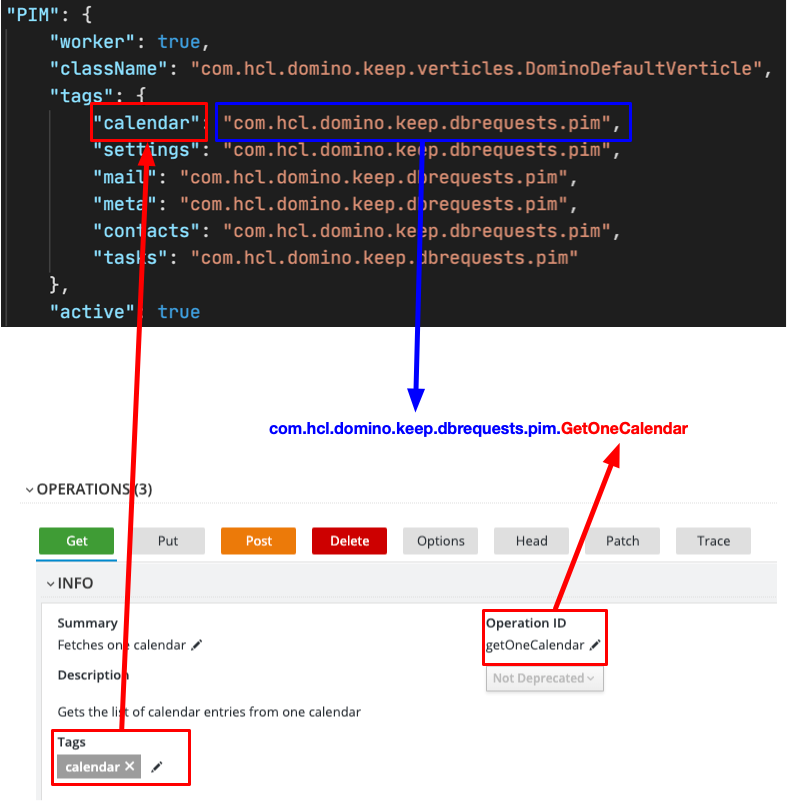

## Extending KEEP (Follow the yellow brick road!)

KEEP is designed with extensibity in mind. To extend KEEP, you should be familiar with Java8, [Maven](https://maven.apache.org), [Eclipse Vert.x](https://vertx.io), [DominoJNX](../howkeepworks/dominojnx/index), as well as our principles:

### Principles

- The source of truth for the API is the [OpenAPI](openapi-spec) specification.
- The OpenAPI **OperationId** is used to identify all actions, based on the package definition in the [config](../installconfig/configuration/security/configjson).
- HTTP request and database operation are separated by the [EventBus](../howkeepworks/eventbus). This allows to distribute load and/or add additional protocols (e.g. gRPC).
- We follow a consistent use of [REST syntax](restprinciples.md).
- We value [Testing](testing/testingindex).
- The application provides metrics.



### Setting up a Maven project

```xml
<dependency>
    <groupId>com.hcl.domino.keep</groupId>
    <artifactId>com.hcl.domino.keep</artifactId>
    <version>${keep.core.version}</version>
</dependency>
```

`keep.core.version` is here a property mapping to the version of KEEP you wish to use. Using properties means you can easily identify and update the versions of dependencies. All properties are grouped at the top of your pom.xml:

```xml
<properties>
    <keep.core.version>1.0.0</keep.core.version>
</properties>
```

### Maven build settings

There are three plugins you should use as a minimum in your Maven build settings:

- maven-jar-plugin jar packaging
- maven-surefire-plugin for running tests
- maven-dependency-plugin for adding the dependencies to your target folder

```xml
<build>
   <plugins>
      <plugin>
         <groupId>org.apache.maven.plugins</groupId>
         <artifactId>maven-jar-plugin</artifactId>
         <version>${maven.jar.plugin.version}</version>
         <configuration>
            <finalName>YOUR-JAR-NAME</finalName>
         </configuration>
      </plugin>
      <plugin>
         <artifactId>maven-surefire-plugin</artifactId>
         <version>${maven.surefire.plugin.version}</version>
         <configuration>
            <includes>
               <include>*Test.java</include>
               <include>*Tests.java</include>
               <include>*TestCase.java</include>
            </includes>
         </configuration>
      </plugin>
      <plugin>
         <groupId>org.apache.maven.plugins</groupId>
         <artifactId>maven-dependency-plugin</artifactId>
         <version>${maven.dependency.plugin.version}</version>
         <executions>
            <execution>
               <id>copy-dependencies</id>
               <phase>package</phase>
               <goals>
                  <goal>copy-dependencies</goal>
               </goals>
               <configuration>
                  <outputDirectory>${project.build.directory}/libs</outputDirectory>
                  <overWriteReleases>false</overWriteReleases>
                  <overWriteSnapshots>true</overWriteSnapshots>
               </configuration>
            </execution>
         </executions>
      </plugin>
   </plugins>
</build>
```

Again, this uses properties for the plugin versions. A special variable `${project.build.directory}`, maps to your target output folder. Full releases with no version number change are not overwritten but snapshots are.
Ensure you change `YOUR-PROJECT-NAME` to the jar name you want to use for your extension. Internally we use “keep-experimental” for experimental code, so avoid using that.

### OpenAPI specification

You need to create an OpenAPI specification for your extensions. [Apicurio](https://www.apicur.io) is a good tool for building your OpenAPI spec. It gives a GUI for building an OpenAPI, as well as a source view for copying and pasting in. Follow these rules:

- Set up "Data Types". At a minimum, you'll need `errormessage`, `executionrequest` and `executionresult`. You can copy these from the main KEEP OpenAPI spec.
- Set up the default "Responses". You can copy these from the main OpenAPI spec.
- Set up "Security Schemes". You can copy these from the main OpenAPI spec.
- Set up "Servers" for testing. Ensure that the first entry starts `{protocol}://{yourserver}:{port}/` and is followed by a unique API prefix and version number. This is used in the KEEP configuration.
- Set up "Tag Definitions". These should be unique and are cross referenced against the config, for locating the relevant classes.

### config.json

You will need to set up your config.json for your extension, which you later store in the `keepconfig.d` directory. For more details, see [configuration](../installconfig/index). An example is:

```json
{
  "versions": {
    "experimental-v0": {
      "path": "/config/openapi.exp.v0.json",
      "active": true
    }
  },
  "verticles": {
    "Experimental": {
      "worker": false,
      "className": "com.hcl.domino.keep.verticles.DominoDefaultVerticle",
      "tags": {
        "experimental": "com.hcl.domino.keep.experimental"
      },
      "active": true
    },
    "RestAPI": {
      "className": "com.hcl.domino.keep.verticles.HttpListener",
      "worker": true,
      "versions": {
        "experimental-v0": {
          "package": "com.hcl.domino.keep.handlers.experimentalv0",
          "route": "/api/exp-v0",
          "defaultClass": "com.hcl.domino.keep.handlers.v1.DefaultJsonHandler",
          "defaultDatabase": "keepconfig",
          "jsonBodyLimit": 5000000,
          "filesBodyLimit": 10000000
        }
      }
    }
  }
}
```

- versions: defines a version name for this OpenAPI, marks it active and gives the path to find the jar in .json OpenAPI spec file. E.g. here it would look in `src/main/resources/openapi.exp.v0.json`. Ensuring a version number allows you to make breaking changes and route to different Java classes for each version.
- verticles: defines a unique name for managing the NSFHandler verticle for this OpenAPI spec. Typically it does not need to be a worker thread and typically the class name to use for the verticle will be "com.hcl.domino.keep.verticles.DominoDefaultVerticle". You then define the tags to look for in the OpenAPI spec and the package in which to look for the NSFHandler classes.
- RestAPI allows you to merge settings for the WebHandlers. You should not need to override the HttpListener class. But if you do, you can define the class to use here. The "route" defines the path to append to the server and port prior to the paths specified in the OpenAPI spec. A default database can be defined, if no "db" query parameter is passed, then you can manage maximum body size for ContentType as "application/json" and "multipart/form-data" (for files).

### Running and testing your code

You can run and test your code using a KEEP Docker container. See the [Docker documentation page](../installconfig/installation/docker):

- The first `-v` mapping still maps "/local/notesdata/ to the persistent volume for your Domino data.
- The second one should map "/opt/hcl/keep/ to the `target` directory of your KEEP extension project, e.g. `-v /Users/paulwithers/GitRepositories/hcl/keep/keep-experimental/target:/opt/hcl/keep`
