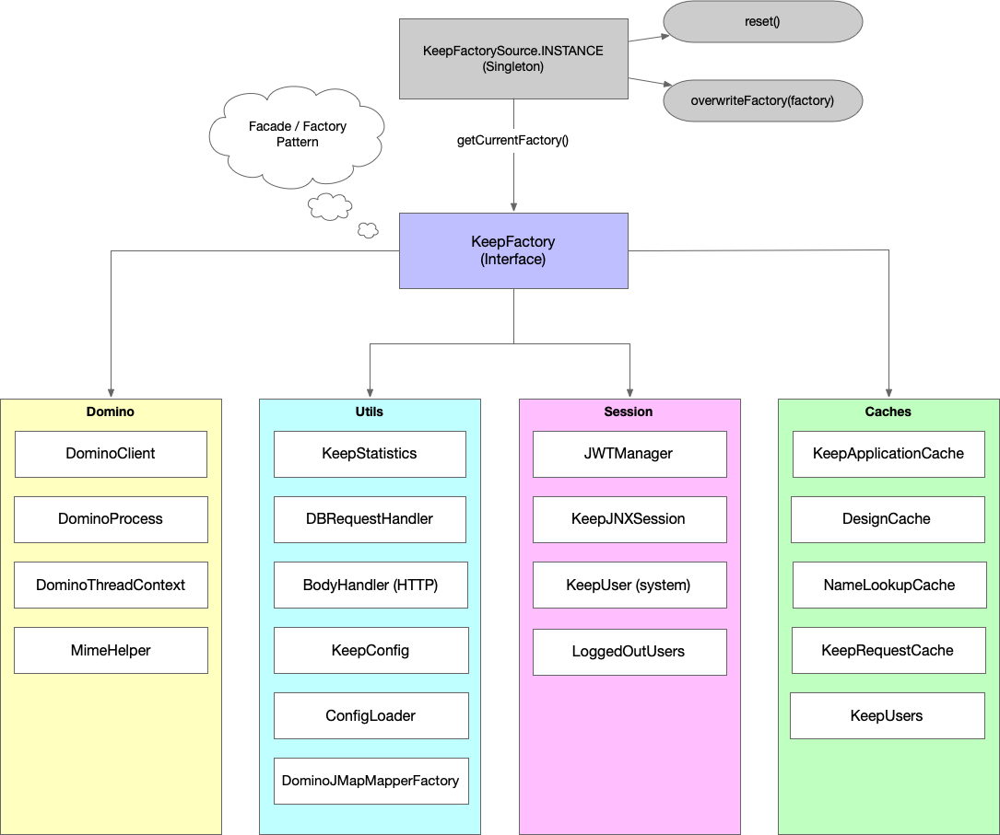

## KeepFactory

The KeepFactory provides access to individual caches for:

- KeepConfig
- DesignCache
- LoggedOutUserList
- JWTManager

It also provides a holder for a relevant user session, a KeepJnxSession object. This is why each instance of `AsyncDominoJNXRequest` creates a new KeepFactory object, to ensure no pollution of KeepJnxSessions.

KeepFactory often needs to work differently for JUnit tests. This is why instances of `AbstractKeepVerticle` (and `AsyncDominoJNXRequest`) create their own instance of KeepFactory and have a setter.

The KeepFactory is also used by the HttpListener and AbstractKeepDataVerticle to load handler classes according to the OpenAPI spec.

## **KeepConfig**

The KeepConfig contains two main objects:

- A map of KeepApiInfo objects, one for each endpoint in the OpenAPI spec with an operationId. The key in the map is the operationId. The contents are loaded when KEEP loads. The KeepApiInfo object also checks whether it can work as a JSON handling endpoint, if it a) responds with JSON and b) receives only JSON or expects no body.
- A map of KeepDbInfo objects, one for each database exposed for KEEP access. The key in the map is the KEEP name for the database. The structure is:
  - ApiName.
  - FilePath.
  - Icon.
  - IconName.
  - Description.
  - List of owners, for reference purposes only.
  - FormulaEngine (currently just "domino", future plan will include OpenFormula.
  - Whether or not it's active.
  - UNID of the Notes Document in KEEP Config database.
  - ConfigInfo, indicating:
    - Whether the database allows access from browsers (openAccess).
    - Whether the database allows code to be submitted via the "/run/code" and "/run/codejs" endpoints (allowCode).
    - Whether Domino Query Language (DQL) can be run against the database (dqlAccess).
    - Formula (applied according to the formulaEngine) for more tightly constraining access to DQL (dqlAccessFormula).
    - List of views that can be used from KEEP (availableViews).
    - List of agents than can be run from KEEP (agents).
    - List of stored procedures (code that the KEEP Administrator has added to be run) - NOT YET IMPLEMENTED (storedProcedures).
    - List of people who must approve requests for external applications to use this database - NOT YET IMPLEMENTED (applicationAccessApprovers).
    - Map of FormAccessModeInfo objects (formConfigs) where the modeName is the key. Every form exposed must have at least one FormAccessModeInfo for a modeName "default". Each FormAccessModeInfo contains:
    - ModeName.
    - List of fields exposed to read access (readAccessFields).
    - List of fields exposed to write access (writeAccessFields).
    - Formula (applied according to the formulaEngine) for read access (readAccessFormula).
    - Formula (applied according to the formulaEngine) for write access (writeAccessFormula). This can include validation of the payload.
    - Formula(s) to be applied for any GET requests for the form mode (onLoad).
    - Formula(s) to be applied before saving any documents for this form mode (onSave).
    - Whether the Input Translation and Input Validation formulas on the underlying Notes Form should be applied (computeWithForm).
    - Whether a POST request should be rejected if the content does not conform with the list of fields expected for write access (strictInput). If set to false, any fields not in the writeAccessFields are just ignored.

The KeepConfig is also used to:

- Get and retrieve the system user name.
- Check if local users are allowed, managed via the GodMode environment variable.
- Scan and retrieve actual database names for KEEP Admin module.
- Read the JSON OpenAPI spec.

## DesignCache

This is a cache for a database's design. It's populated from DesignFetchdxlRequest. Requests for individual design elements automatically route through DesignFetchdxlRequest if the design has not yet been cached. There are two buckets of data:

- **bucket**, containing the design extracted as a JSON object.
- **dxlbucket**, containing the raw DXL.

Entries are removed from the caches after 8 hours. There is also a specific endpoint to evict the whole cache.

The design cache is used by the KEEP Admin module to select:

- **Views** to _enable__ from KEEP access.
- **Forms** to _enable_ for KEEP access.
- **Agents** to _expose_ for KEEP access.
  As a result, anyone using the KEEP Admin module must have a minimum of Designer access to the databases they are enabling for KEEP access.

## JWTManager

This is responsible for generating JWT tokens.

## LoggedOutUserList

This uses an ExpiringMap to auto-expire JWT tokens. The "/logout" endpoint also expires a JWT token. The expired tokens are checked by the "jwt" security handler, `ExpiringJwtHandler`.
