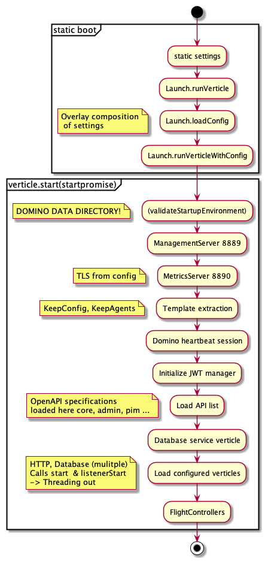
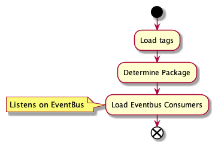
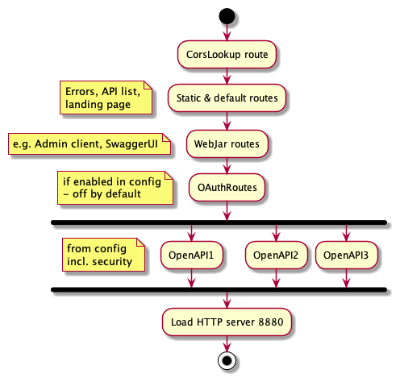
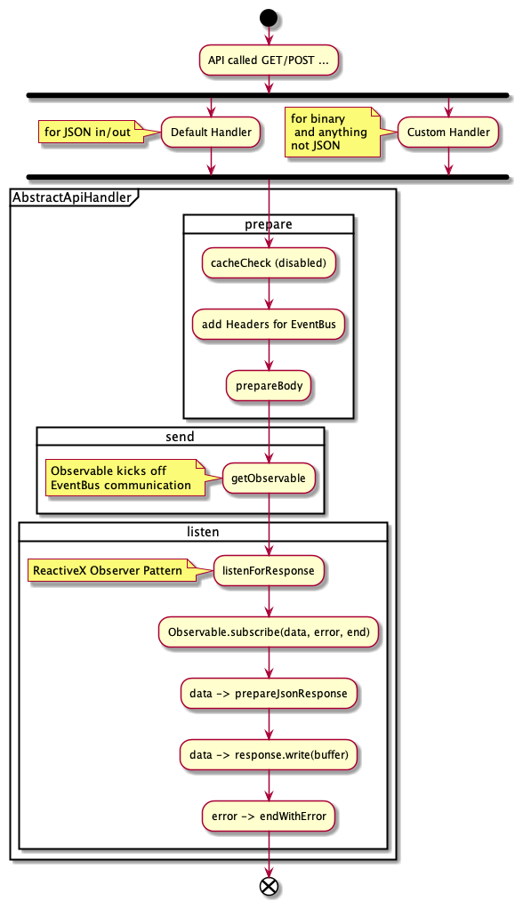
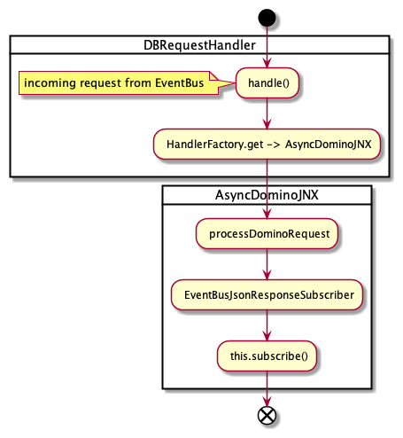
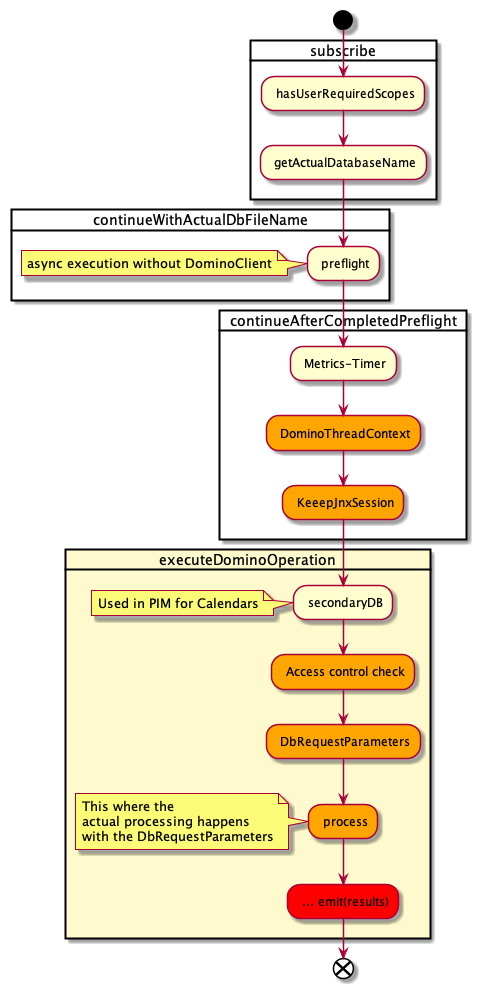

## Selected Flows in the KEEP Architecture

To fully understand KEEP, it is helpful to know the main flows, KEEP has three of them:

- KEEP Boot
- Loading of OpenAPI defined routes
- serving requests on the loaded routes

## KEEP Boot

## Loading of OpenAPI defined routes

## Serving requests on the loaded routes

### Accepting requests on HTTP

Request get put on the EventBus after successful acceptance

### Processing requests from EventBus

Actual database communication happens here

