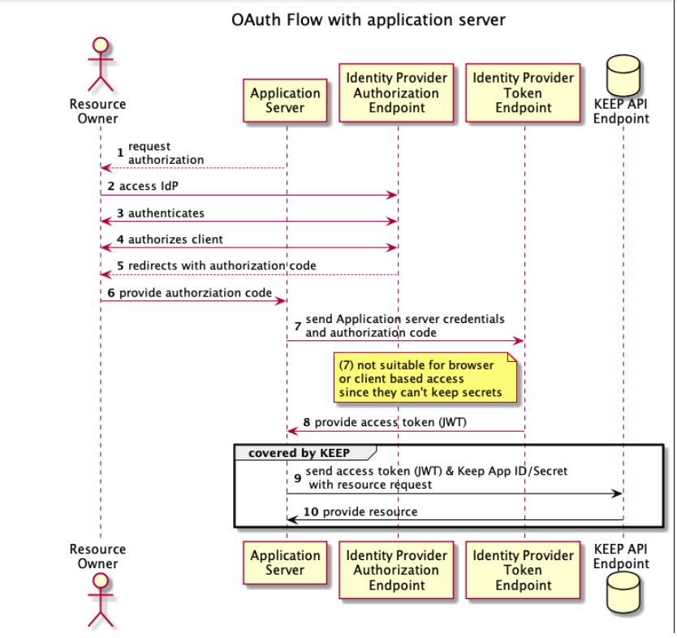
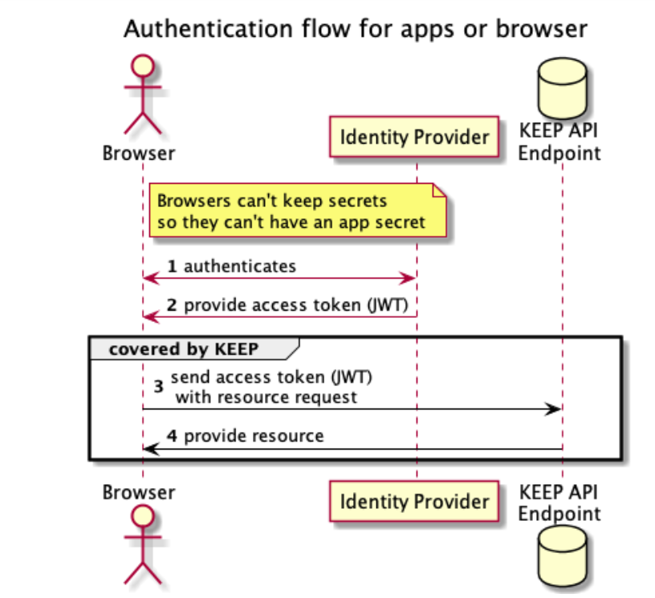

## Authentication

KEEP offers a built-in endpoint to exchange your Domino credentials for a valid JSON Web Token (JWT). This page describes the setup of external JWT identity providers.

### JWT Authorization

All actions in KEEP are secured with JWT. For starters, Domino provides a login endpoint that issues a valid JWT token to access KEEP in exchange for Domino credentials (user name and http password).

The Domino generated JWT:

- Uses a random symmetric key that changes on every KEEP restart and is stored only in memory.
- Works with one Domino server.
- Can be disabled in KEEP configuration with `"disableDominoLogin" :true` .

Should Domino use a permanent JWT Key, we can use a public/private key pair and add it to the KEEP configuration:

```json
{
  "JwtUsePubPrivKey": true,
  "JwtUsePemFile": true,
  "JwtIssuer": "DominoKeep",
  "JwtPrivateKeyFile": "path-to-private.key.pem",
  "JwtPublicKeyFile": "path-to-.public.key.pem",
  "JwtAlgorithm": "RSA"
}
```

These keys can be shared between Domino servers, allowing, for example, redirects to a different mail server.

### External JWT provider

This is the configuration we would strongly suggest for outward facing Domino servers. KEEP can accept JWT tokens from multiple external providers.

To enable an external provider, KEEP requires access to the provider’s public key, which is added to the KEEP configuration:

```json
{
  "jwt": {
    "some-name": {
      "active": true,
      "algorithm": "RS256",
      "keyFile": "path-to-jwt.pubkey"
    }
  }
}
```

It is the responsibility of the administrator to save key files in secure locations.

### JWT Payload

The JWT requires the following format (Additional entries get ignored):

```json
{
  "iss": "Issuer Name",
  "sub": "CN=Common Name/OU=Unit/O=Org",
  "scope": "MAIL $DATA $DECRYPT",
  "iat": 1619554552,
  "exp": 1619558152,
  "aud": "Domino"
}
```

All elements need to be present, “audience” must be set to “Domino” and “scope” must be a space-separated list of database aliases, MAIL, and/or $DATA.

- MAIL allows a request to attempt to access the mail file of a given user. Access is limited by Domino’s ACL entries.
- $DATA allows a request to attempt to access any database configured for KEEP access. Access is limited by Domino’s ACL entries. Users can only access databases that grant them access in the ACL.
- $DECRYPT (WIP) Allow to decrypt documents secured with encryption. Without that parameter no access to an ID in the ID vault is attempted.
- [KeepDBAliasName] allows a request to attempt to access a database configured under that alias name. Access is limited by Domino’s ACL.

### KEEP and OAuth

KEEP is designed to consume an access token. This token can be the result of an OAuth dance or simply the result of an exchange of Domino credentials. The KEEP API does not participate in an OAuth dance, it uses the result of it.




