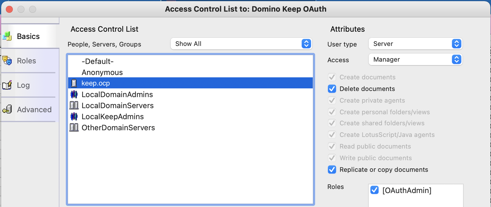
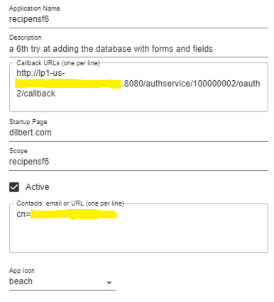

# Configuring Keep IDP with VoltMX Foundry Identity Service

Keep implements what essentially amounts to an OAuth2 Provider (called `IDP-lite`) and Volt MX Foundry implements an Integration Service adapter for OAuth2 providers. The following is a guide for creating a Foundry Identity Service using Keep's OAuth provider.

## KEEP Setup

Warning. This is subject to change. Consult Keep documentation (or code, or experts) for the latest steps. Currently, these general steps must be performed:

1. Deploy `oauth.nsf` and configure KEEP to recognize that file
1. Add `OAuthAdmin` role for the ACL entry that gives your server manager access to the `oauth.nsf`

To deploy and configure the NSF, place the following in the domino data directory (you may need to create the keepconfig.d folder if it doesn't already exist):

- [data folder]/oauth.nsf
- [data folder]/keepconfig.d/oauth.json

An example of `oauth.json` is shown below. Expiration times can be adjusted. Make sure to replace the KEEP URL to match your KEEP host (a fictitious Quickstart KEEP url is shown in this example.)

```json
{
  "oauth": {
    "active": true,
    "database": "oauth.nsf",
    "url": "http://yourquickstarthost-qs-keep-8880.qs.hcllabs.net",
    "authCodeExpiresIn": 120,
    "accessTokenExpiresIn": 3600,
    "refreshTokenExpiresIn": 525600
  }
}
```

Note if you are using Domino+KEEP docker image, the `oauth.nsf` should already be "deployed" in the image (though not fully configured as of this writing). If for some reason you need to create `oauth.nsf`, it can be created from a template as follows:

1. Start the notes client
2. File - Application - new (or Ctrl+N)
   a. Pick (the target) server
   b. Set file name to oauth.nsf
   c. (Set title as you deem fit)
   d. Pick `KeepOauth.ntf` as the application template
3. Asssign the role `[OAuthAdmin]` to the server and your administrative user or usergroup (we suggest `[LocalKeepAdmins]` using your notes client.Make sure there is an ACL entry of type `server` (for your server) that has Manager access and has `OAuthAdmin` role (make sure the checkbox is checked).



If you don't have the ability to connect a Notes client to your Domino server then:

1. Add the `oauth.nsf` to your list of KEEP databases
2. Use postman or cUrl to add the `OAuthAdmin` role (see example, but note that headers are removed for clarity):

```json
 curl --location --request PUT 'http://yourkeepserver.io:8880/api/admin-v1/acl/entries/CN%3Dyourkeepserver%2FO%3Dyourorg?dataSource=oauth.nsf' \
--data-raw '{
    "name": "CN=yourkeepserver/O=yourorg",
    "level": "MANAGER",
    "roles": ["OAuthAdmin"],
    "type": "SERVER",
    "flags": ["NODELETE"]
}'
```

**Note:** The part after `/entries/` before `?dataSource` must be [URL encoded](https://en.wikipedia.org/wiki/Percent-encoding)
{: .alert .alert-info}

## Create Foundry Identity Service

Some things to note when creating an identity service in Volt MX Foundry using Keep IDP-lite (also refer to the screenshot below):

Create a new Identity service in the Foundry browser console:

1. Type of identity = OAuth 2.0
1. Grant Type = Authorization Code
1. Authorize Endpoint = `[your Keep API server]/oauth/authorization`
1. Token Endpoint = `[your Keep API server]/oauth/token`
1. **IMPORTANT** - make sure to select **`Form Param`** under `Advanced` {: .alert .alert-danger}
1. Take note of the `Callback URL`
1. Pause here for a moment (don't save yet), and complete the steps for [setting up Keep databases and applications](#Keep-Application-and-Database-Setup)
1. Scope = database `name` (API Name) for the database added in the next step; if more than one database, you should be able to enter a list of database names; check Keep documentation to see how the names are delimited (perhaps a comma or space, but to keep it simple, just enter one db name if uncertain about how to specify multiple)
1. Client ID = `App id` from the application created in the next section below
1. Client Secret = Obtained when you first creat the appliction (next section)
1. Now you can `save`


## Keep Application and Database Setup

From the Keep Admin browser client:

1. Add a database, and note its name (API name, when you create the DB in Keep)
1. Create an application, and note its client id, and client secret

Note:

- When you create the application, you'll need the callback URL [defined earlier](#Create-Foundry-Identity-Service)  
  
- App id (Client ID) is available any time you view a created application. The secret is shown only when the the secret is created the first time. If you forget the secret, generate a new one (click the circular arrow).  
  

YMMV
