## Configuring Keycloak

[Keycloak](https://www.keycloak.org/) is an Open Source Identity and Access Management sponsored by [RedHat](https://www.redhat.com/en).

Keycloak can be used to produce JWT Access Token for KEEP. This section describes some of the key concepts and the steps required to configured Keycloak successfully for KEEP (it can be used for classic Domino SAML as well).

Keycloak has many features likeIn its default configuration, Use Federation, Identity Brokering or Social Login. Those are topics not covered here, you want to consult a [Keycloak Tutorial](https://duckduckgo.com/?q=keycloak+tutorial&ia=web) or the [Keycloak documentation](https://www.keycloak.org/documentation) to learn more. This page focuses on the settings required for KEEP

## Keycloak concepts

Listing the relevant only here

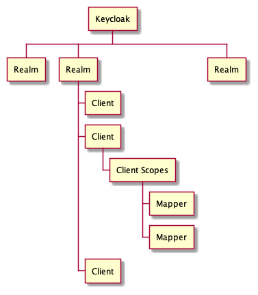

- **Realm**: The starting point for Keycloak identity management, contains all other elements
- **Client**: Each accessing application, client app, Single Page App or server app will have a client entry. The client entry contains application Id and, if required, the application secret
- **Client Scopes**: Attributes and properties available and/or assigned to client entries
- **Mapper**: Configuration entry to determine what information is available in a client scope

Not listed: Users

We will create a realm, an user, two clients (one for a SPA, one for a server based app), a client scope for shared settings and a few mappers

## The steps in pictures

Login to Keycloak. Click on the down angle next to the `Master`, add a new realm. In our example _Trantor_

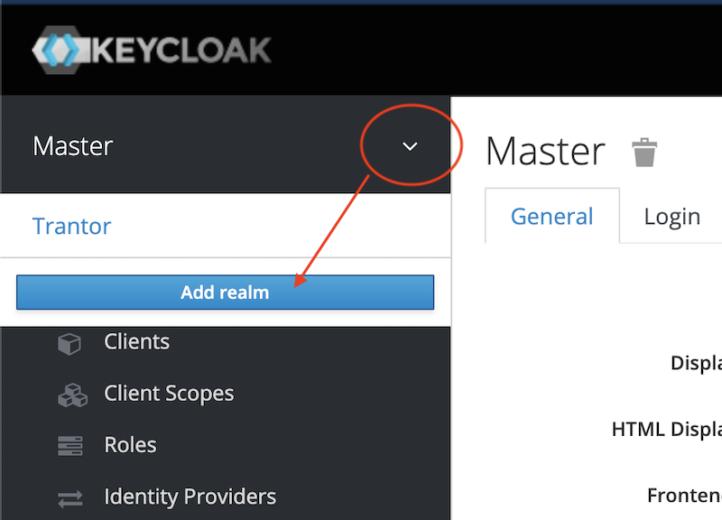

Fill in the minimum information

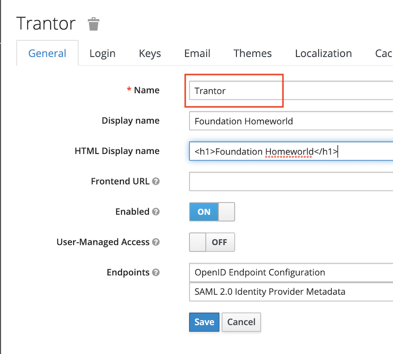

Now create a user. In a production environment you probably would connect to an existing LDAP or Active Directory server. Check the documentation for details about that.

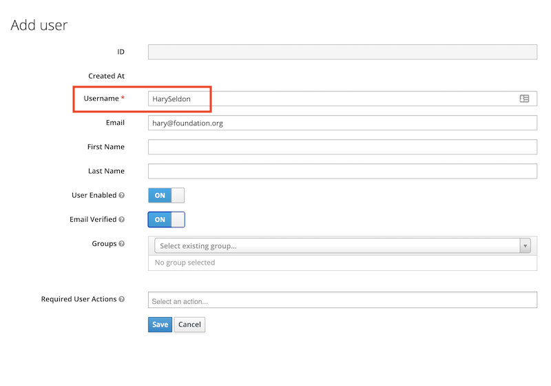

To make it compatible with Domino and KEEP, we need the X500 style **distinguished name** of the user. We maintain that as the attribute `dominoDN`. In your environment it might have a different name, which you later need to use in the mapper

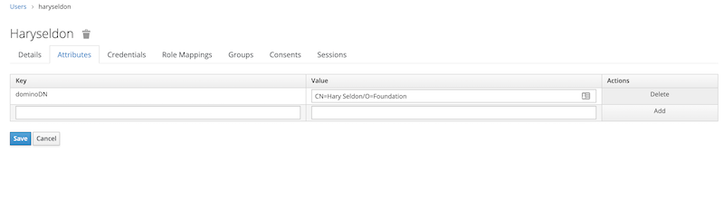

Next step is to create a client scope named `keep-common` which will contain the settings that are common to all clients (a.k.a apps) accessing KEEP

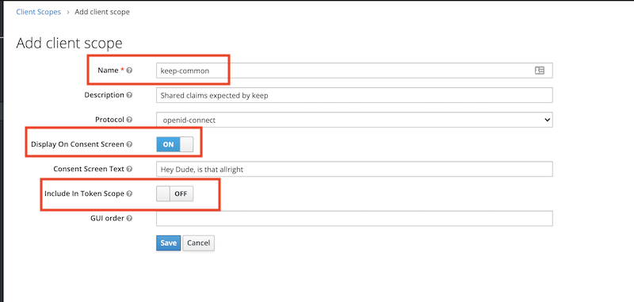

Next step is to add two mappers for `aud` and `sub`:

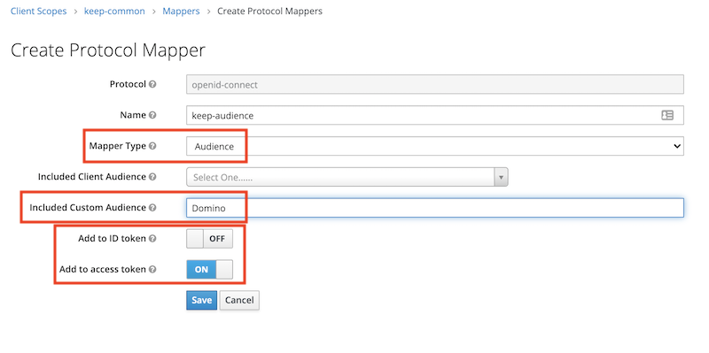
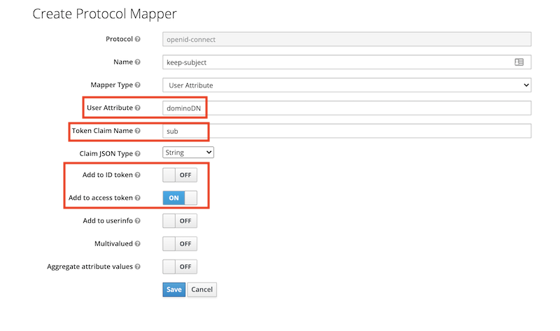

Next create a client. The example below is for an application server that can present a client id and a client secret. An example for a SPA (that can't keep a secret) follows further down.

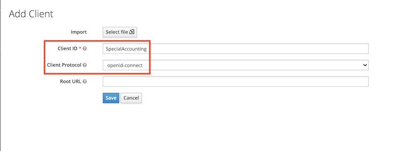
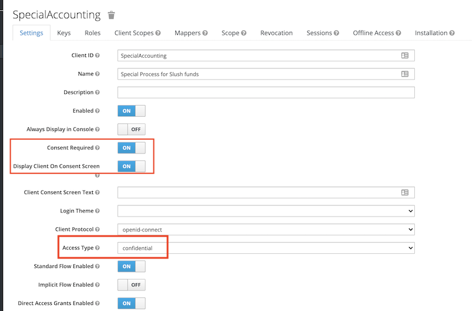
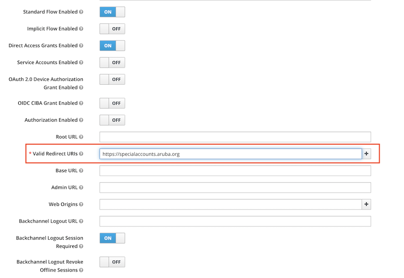

Next step is to assign the client the common client scopes `keep-common` and `offline_access` (this one for the refresh token). Remove the "Assigned Optional Client Scopes" first, so they become available in "Available Client Scopes"

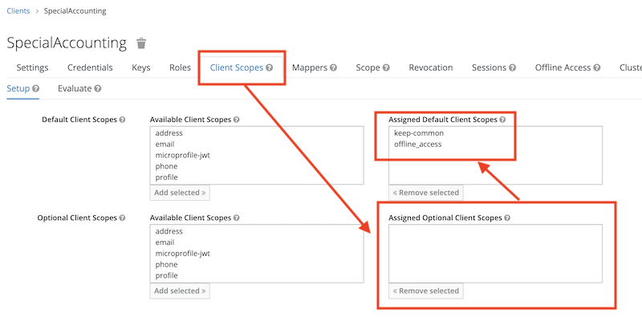

## Application specific scopes

The configuration so far will identify a user presenting the access token to KEEP, but not yet provide any access. We need to specify what scopes this application will be allowed to access. We can use any of the global scopes `MAIL`, `$DATA` or `$DECRYPT` or, preferrably, a lowercase database alias. Multiple scopes are separated using a space.

---

**Note** It is best practise to give an external application as little as possible access so it can function. So think twice before allowing any of the uppercase general scopes

---

The Mapper for the client is individual per application (client):

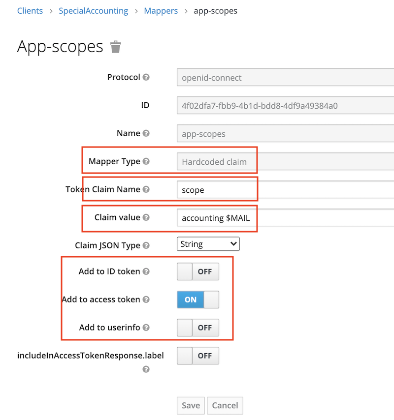

Finally we can verify that an access token has all the required attributes:

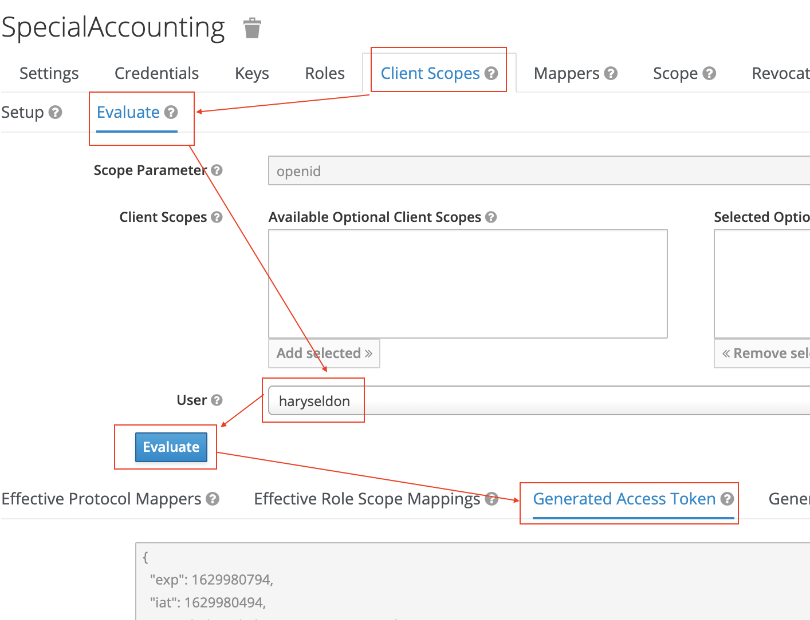

## SPA applications

A SPA (Single Page App) or a mobile client can't keep a client secret. For those the use of Proof Key for Code Exchange (PKCE) (defined in [RFC 7636](https://tools.ietf.org/html/rfc7636)) is recommended (Read [this intro](https://auth0.com/docs/flows/authorization-code-flow-with-proof-key-for-code-exchange-pkce) for details). The only difference in Keycloak is to specify the client `Access Type` as public.

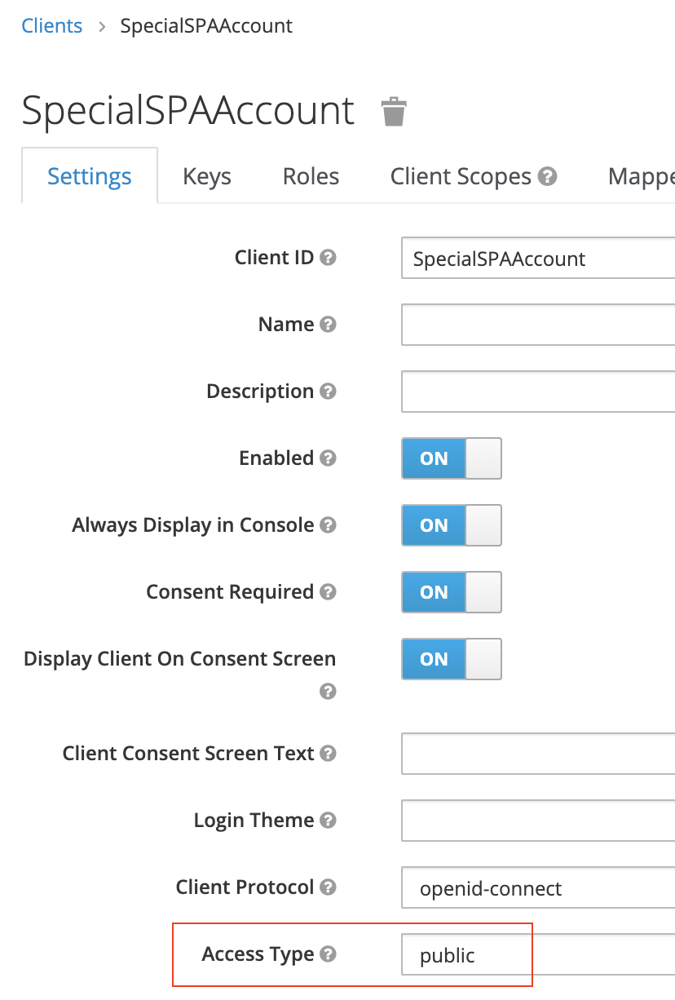

It is **SECURITY** so learn about [Keycloak](https://www.keycloak.org/getting-started)!
