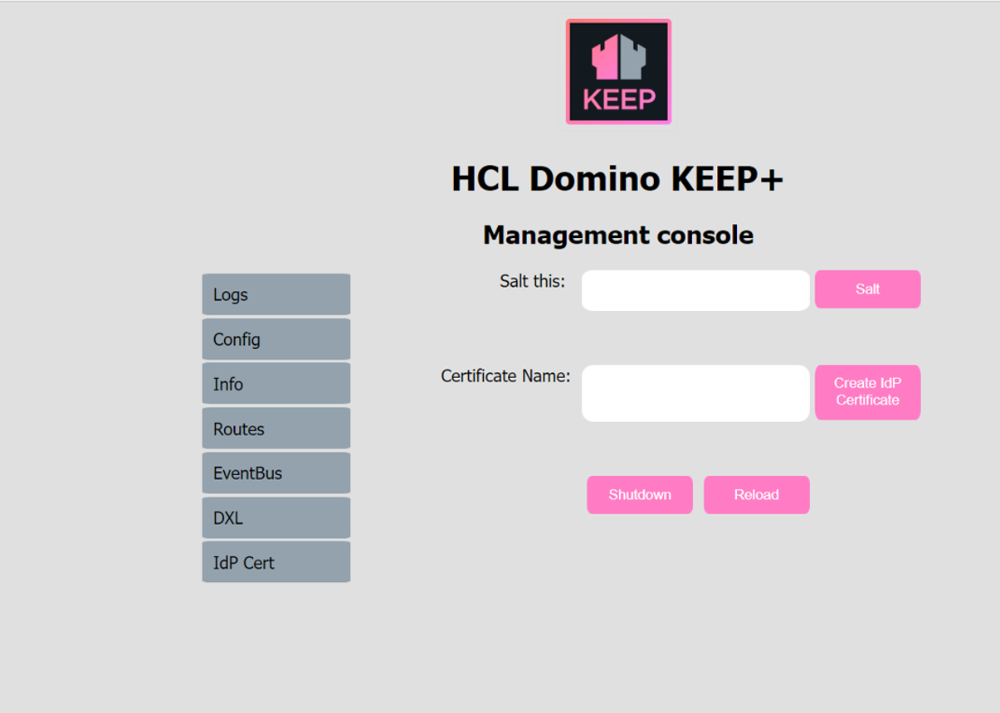

## Encryption

There are three areas in KEEP where encryption keys are needed:

- HTTPS certificates for KEEP ports
- JSON Web Token (JWT) signing
- ID vault signing requests

This page documents the creation of those keys. Check the [security](../security.html) page for configuration details.

## HTTPs certificates for KEEP ports

When your server is facing the internet or you can't distribute custom (root) CAs (certificate authorities) to your users, you should consider using a certificate from an official source such as LetsEncrypt. (This documentation does not describe how to do that.) You can run KEEP without encryption, however, unless you run on a container service like Kubernetes or OpenShift, where the container handles encryption, a Kitten must die when you deploy to production.

If you create your own CA, you must:

- Create the private key and root certificate.
- Create an intermediate key and certificate.
- Create certificates for your servers.
- Convert them if necessary (e.g. for import in Java Keystors JKS).
- Make the public key of the root and intermediate certificates available.
- Import these certificates in all browsers and runtimes used for testing.

Follow the [detailed instructions](https://www.wissel.net/blog/2019/10/create-your-own-ca.html) and the [followup](https://www.wissel.net/blog/2019/10/a-certificate-wants-a-san.html).

Again: **It's generally better to use [LetsEncrypt](https://letsencrypt.org/)**.

## Encryption key for JWT signing

KEEP uses JWT for authentication. When you get started with KEEP, you probably log in with a Domino user name and password. KEEP, out of the box, uses an ephidermal symmetric encryption key to sign requests. Since you can't see the key or share it, this configuration is reasonably secure. When you restart KEEP, a new key is used.

To use a key that can be deployed to an external identity provider (IdP) or used to send requests to the Domino ID vault service, you must generate a public/private key pair and configure the [security](../security.html) settings. Never share the private key!

Use the [OpenSSL](https://www.openssl.org/) tool to generate a key. The key is an [RSA](<https://en.wikipedia.org/wiki/RSA_(cryptosystem)>) key:

```bash
ssh-keygen -t rsa -b 4096 -m PEM -f private.key
openssl rsa -in private.key -pubout -outform PEM -out public.pem
```

If you prefer [Elliptic-curve](https://en.wikipedia.org/wiki/Elliptic-curve_cryptography) keys (smaller, more modern), use this:

```bash
openssl ecparam -genkey -name secp521r1 -noout -out privatekey.pem
openssl ec -in privatekey.pem -pubout -out publickey.pem
```

The parameter `-name secp521r1` defines the **ES512** encryption algorithm. Don't change the parameter.

## Encryption key to sign ID vault requests

The required key is an ES512 elliptic-curve as described above. Keep the private key safe and configure it in [security](../security.html). The public key must be imported into the ID vault. Check the documentation there.

```bash
openssl ecparam -genkey -name secp521r1 -noout -out privatekey.pem
openssl ec -in privatekey.pem -pubout -out publickey.pem
```

## Using the Management Console for encryption operations

The management UI offers convenience functions for encryption and certificate related activities.



### Hasshing a salted password

The shutdown key, as well as the metrics credential password are stored salted and hashed in the KEEP configuration ini files. To change one of them, the `salt` button can be used to compute a replacement value. Enter the password, it isn't hidden here, click on `Salt` and the salted and hashed version will be shown in the UI, where you can copy & paste it for use in a configuration json file.

### Generate keys and certificates for SAML and JWT

KEEP used X509 certificates and a public/private key pair for [SAML](../keepsaml) interaction with the Domino R12 [IDVault](# TODO: link to vault). The management console offers a convenient way to generate those and the needed configuration entries.

Note: You need access to the Domino server's file system to collect the keys/cert
{: .alert .alert-danger}

Enter a certificate name, don't use spaces or special characters, stick to: `0-9,a-z,A-z,-,_`.
Then enter the `Shutdown key` (masked input) and click on `Create IdP Certificate. 4 things will happen:

- Creation of an `X509` certificate
- Creation of a public/private key pair
- Creation of a configuration json file
- Update of the IdP Cert button on the management page

The 4 files get created in your `keepconfig.d` directory. Distribute them to all KEEP servers to achive single login and decryption capabilities. For example, when you specified **AcmeKeepTest** as your `Certificate Name`, you get this configuration file:

```json
{
  "JwtUsePubPrivKey": true,
  "JwtUsePemFile": true,
  "JwtIssuer": "CN=ServerName/O=OrgName/F=AcmeKeepTest",
  "JwtPrivateKeyFile": "keepconfig.d/AcmeKeepTest.private.key.pem",
  "JwtPublicKeyFile": "keepconfig.d/AcmeKeepTest.public.key.pem",
  "JwtCertFile": "keepconfig.d/AcmeKeepTest.cert.pem",
  "JwtAlgorithm": "RSA"
}
```

YMMV
