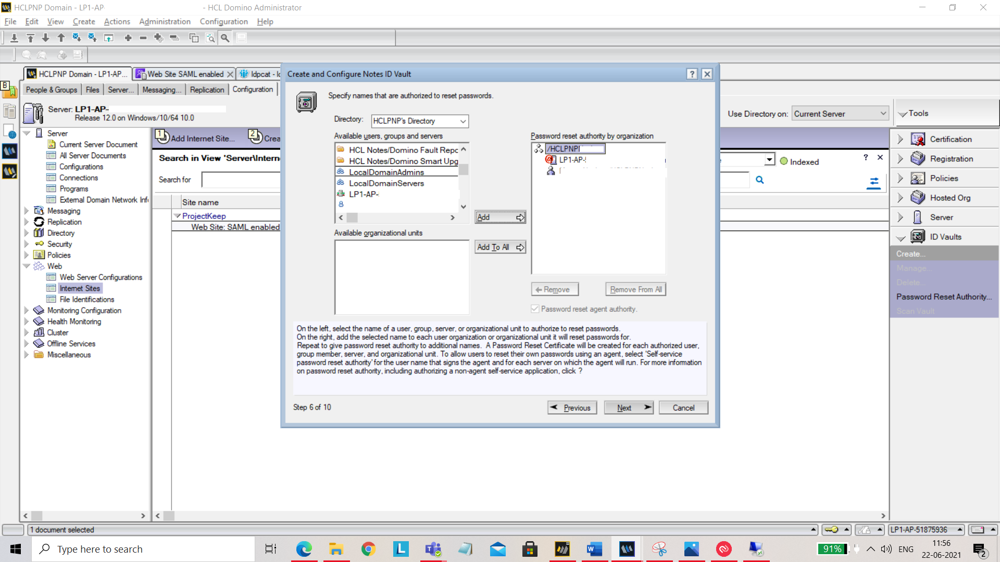

## KEEP SAML configuration

To be able to access encrypted resources, like emails or confidential documents in application databases, KEEP needs to be configured as a SAML identity provider. 

There are two scenarios:

- KEEP is the only identity provider (This feature is subject to a later code drop)
- KEEP is an additional identiy provider (This feature is subject to a later code drop)

SAML is already available for you. You just need to add KEEP as an Identity Provider. Below is how you can do that and setup websites to use an ID Vault via SAML. 

1. Open Domino Administrator. Go to **_Current Server Document_** and open **_Configuration_** tab. Make sure **_Load Internet configurations from Server\Internet Sites documents_** is enabled. Save and close. 

  
2. From the left panel, select **_Web_** and then select **_Internet Sites_**. Click on **_Add Internet Site_** tab and select **_Web_** from the menu.

  
Now enter the following under **_Basics_**-
**_Organization Name_** (For example: Project KEEP) 
**_Host names or addresses_**: Add your hostname 
**_Domino servers that host this site_**: Add your server Name.

  
Under **_Domino Web Engine_** tab, set **_Session authentication_** to SAML.

  
Under **_Security_** tab, for **_TCP Authentication_**, disable **_Anonymous_**.

  
Save and close.
  
3. Now you need to create idpcat.nsf file using idpcat.ntf template. To do that, click on **_File_**, goto **_Application_** and select **_New_**. In the **_New Application_** pop up, fill in the following details-
**_Server_**: Select your server from the dropdown. 
**_Title_**: Give title as idpcat 
**_Template_**: Click on advanced template and select IdP catalog template.

 
Click **_OK_**. Now try to open the Idpconfig. To do that press **_ctrl+o_**, enter the name of the current server and file name as “idpcat.nsf”. Click on **_Open_**. 

  
Now click on **_Add IdP Config. 
Under the **_Basics_** tab, add the following:
**_Host names or addresses mapped to this site_**: Add your host name
**_Service provider ID_**: Add your server URL 
**_Single sign-on service URL_**: https://keycloak.quattro.rocks/auth/realms/hcllabs/protocol/saml 
 
You should have _descriptor.xml_ file on your machine. Import it here using **_Import XML file_**.

Under **_Client Settings_** tab, set the following:
**_Enable Windows single sign-on_**: Yes 
**_Enforce TLS_**: No

  
Under **_Certificate Management_** tab, click on **_Company name_**. You should see **_Create SP Certificate_** button. 

 
Click on **_Create SP Certificate_** button. You will be prompted for **_Company name_**. Give a unique name. Also set the below field:
**_Domino URL_**: Add your service URL
  
Now click on **_Export SP XML_** and save ServiceProvider.xml for further use.

  
Save and close.
  
4. Now we will create ID Vault. 
Open **_Domino Administrator_** and expand **_ID Vaults_** on right hand side navigator.

  
Click on **_Create..._**. On the dialog that comes up, click on **_Next_**.

  
On the next screen, add **_ID vault name_** and click **_Next_**.

  
On the next screen, set your password and hit **_Next_**.

  
On the next screen, select the **_Vault server_**.

  
Add or remove administrators who can access vault.

  
You can also add or remove organizations.

  
You can specify who is authorized to reset passwords.

  
Click on **_Next_** and select **_Create a new policy assigned to specific people or groups._**

  
You can add or remove people who can add or edit ID vault policy settings.

  
Set the hint for **_Forgotten Password Help_**.

  
Now by clicking on **_Create Vault_**, the vault will be created. 
 
You now need to set up your ID Vault. 
Open your vault NSF(For example: IBM_ID_VAULT\testsaml.nsf). Click on **_Open_** by selecting the file. 
  
Navigate to **_Configuration_** tab, edit document and add the host address in **_Web federated login approved IDP configurations_**. 
  
  
  

  

