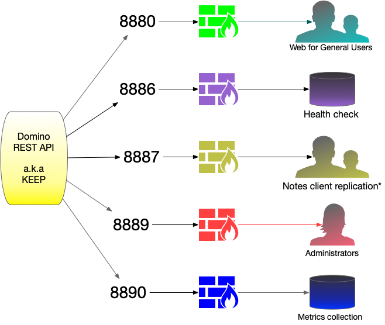
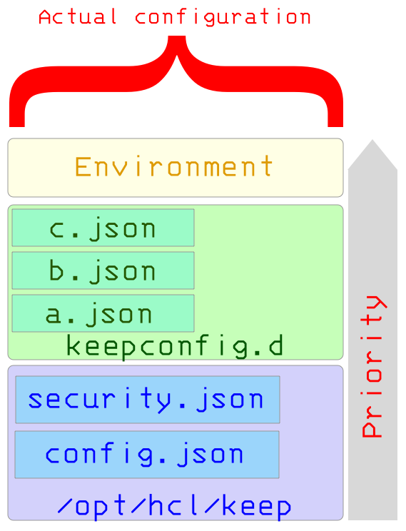

## Securing KEEP endpoints

KEEP uses three endpoints:

Only one must be reachable by users (humans or servers). Configure your firewall accordingly and eventually use [a proxy](./httpsproxy).

To be able to securely and efficiently deploy KEEP into a production environment, you must understand how KEEP configuration works. See the [configurating section](../../../index) for a deeper dive.

The KEEP configuration includes the KEEP binary directory, `keepconfig.d`, and environment variables.

Examples of the default security settings are here, [security.json](./securityjson) and the default configuration settings are here, [config.json](./configjson). Whenever you do a new KEEP install, these two files and the projectkeep.jar file are overwritten.

We recommend that you keep your configuration changes in the `config.d` directory so that they persist when you reinstall or update your KEEP version.

### Endpoint auth

- The REST API endpoint (8880) is secured, requiring a valid JWT token for access. This token needs to be obtained from an IdP. For easy configuration Domino can act as this IdP.
- TThe metrics endpoint (8890) uses BASIC authentication with the user name set in the configuration variable `metrics/metricsUser` and the salted and encrypted password in the configuration variable `metrics/metricsPassword`. It is strongly recommended to update these values and only share with the metrics owner. The metrics endpoint is read only.
- The management endpoint (8889) uses basic authentication. it can serve multiple users configured in the `managementAPI` key of the configuration.

The credentials for the management endpoint are **deliberately NOT** retrieved from a directory service (Domino or otherwise) to be able to access the management API on failure of individual components (last code standing). Trying to link this API to a directory service would defeat the purpose of the management endpoint.
{: .alert .alert-danger}

### Areas of security to assess and implement

- Which ports to open and close:

  - You must secure your admin port, 8889 and metrics port, 8890 from the outside world.

- How to handle HTTPS (via proxy or let KEEP handle it):

  - For configuring HTTPS via proxy, see the example under [HTTPS via Proxy](./httpsproxy).
  - KEEP supports three different types of certificates: PEM, JKS, and PKS.

- How to handle JWT authentication token:

  - Single server built-in, where each server issues and uses their own JWT token.
  - Multi-server built-in, where a multi-server environment reacts to the same JWT token.
  - External identify provider, for example, Active Directory, [Keycloak](https://www.keycloak.org/), etc.

- KEEP can access encrypted resources when Domino's ID vault is deployed and the [KEEP SAML](./keepsaml) configuration is set up correctly.
  - Details are still being ironed out on how to do this. Will update this as soon as we have a solution.
