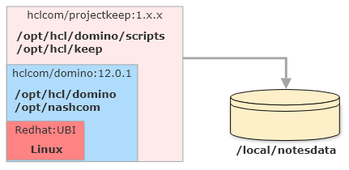

## Running KEEP with a Docker image

The KEEP Docker image is built on top of an HCL Domino Docker image, inspired by [the open source templates](https://github.com/IBM/domino-docker).
All configuration options found there can be applied to the KEEP Docker image. You will need to decide if you want to run a standalone server or an additional server in an existing Domino domain.

### Prerequisites

Running KEEP with a Docker image requires the following:

- A Docker installation, both **Docker** (for servers) or **Docker Desktop** are suitable. Download and install [Docker desktop](https://docs.docker.com/get-docker/) for your environment (Linux, Windows or macOS).
- **[Docker Compose](https://docs.docker.com/compose/install/)**. When you install a Docker Desktop version (Windows, macOS), Docker compose is already included. For servers, it is an [additional install](https://docs.docker.com/compose/install/).
- Login to HCL's instance of [FlexNet](https://hclsoftware.flexnetoperations.com/) using your credentials and download the [KEEP Docker image](https://hclsoftware.flexnetoperations.com/flexnet/operationsportal/entitledDownloadFile.action?downloadPkgId=HCL_Domino_REST_API_EAP) as an archive file.
- A valid Domino server id, when you want to run as additional server in your existing domain.
- A Docker compose file from our [resources](../../../references/downloads). Select the matching one for either a standalone primary or a secondary server.
- A `.env` file. Download the `sample.env` from our [resources](../../../references/downloads). You **must rename the file to `.env` and edit** the `.env` file and update your values!

### Getting Ready

A Domino server uses one persistent volume to store its data. This volume also stores log files and the server’s ID file. When you remove the container, that volume remains and is reused when you start a new container instance.



When you want to run multiple servers, create separate volumes for each, DO NOT share volumes between running instances.

- Make sure, your server id file is named `server.id`.
- Rename the compose file you downloaded from [resources](../../../references/downloads) to `docker-compose.yml`.
- Edit the `.env` file to update your values. You need to replace all values after the equal (`=`) sign

You can configure multiple Domino servers in a single compose file. For details, check the [Docker compose](https://docs.docker.com/compose/) documentation. Keep in mind, each server needs its own volume.

Load the docker image that you've downloaded from [prerequisites](#prerequisites) above:

```bash
docker load -i [name_of_tar_file].tar
```

### Table of variables

Depending on the compose file you choose, a different set of variables needs to be replaced. If a variable isn't in the compose file, you don't need it.

| Variable         | Example                | Remarks                                        |
| ---------------- | ---------------------- | ---------------------------------------------- |
| hostname         | domino.acme.com        | Pro tip: use something.local dor local testing |
| admin_name       | Peter Parker           |
| container_name   | domino-keep-test02     |
| domain_name      | MarvelPhase4           | YOUR EXSISTING NOTES DOMAIN                    |
| org_name         | Stark Industries       | YOUR EXSISTING ORG                             |
| server_name      | keep-server-01         |
| network_hostname | keep01.domino.acme.com | MUST RESOLVE                                   |
| admin_server     | domino01               | YOUR EXISTING SERVER                           |
| admin_ip         | 10.45.10.3             | MUST BE REACHABLE, can use DNS too             |
| volume_name      | domino_keep_notesdata  | no spaces or special chars                     |
| admin_firstname  | Paul                   |
| admin_lastname   | Herbert                |
| admin_password   | domin4ever             |
| cert_password    | supersecret            |

## Running KEEP

Start KEEP using `docker-compose` on all supported platforms:

```bash
docker-compose up
```

---

> Note Start in the directory where the files `server.id` and `docker-compose.yml` are located!

---

The setup can take a few minutes, depending on your hardware and the network speed to your primary server.

---

> Pro Tip: when you don't have DNS setup, amend your hosts file for name resolution:
>
> - `/etc/hosts` on Linux or macOS
> - `C:\Windows\System32\drivers\etc\hosts` on Windows

---

Note:

- You can then use Docker desktop to start/stop the container.
- Use `docker-compose up -d` to run docker in the background.
- Do not run two KEEP containers sharing the same volume at the same time, alternate (e.g. debug/non-debug) or with 2 different volumes is OK.

## Validation

To validate that an instance is successfully running on a container:

- A docker container should be created and running on your docker machine. To check that the container is up, issue this command on a terminal:

```bash
docker ps
```

- The container should be accessible via

```bash
docker exec -it $containername /bin/bash
```

- Domino should be accessible on `http://$host:80` (might need configuration).
- KEEP should be accessible on `http://$host:8880`.
- KEEP Management should be accessible on `http://$host:8889`.
- Metrics should be accessible on `http://$host:8890/metrics`.
