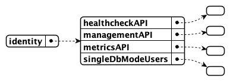
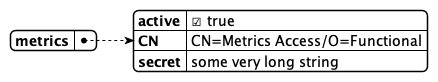

{::options parse_block_html="true" /}

# Functional Accounts

There are a series of endpoints that are not associated with regular user ids:

- Management console (Port 8889)
- Metrics endpoint (Port 8890)
- Health check (Port 8886)

To enable access to those, you need functional accounts. Same applies to the use of KEEP in a local context when running on a client.

There are multiple reasons to keep this users separate from your enterprise directory:

- They need to be available when the directory is not available
- They don't need access to regular end points

## Functional users configuration file

Create a file `functionalUsers.json` in the directory `[NotesData]/keepconfig.d`. Add the following JSON structure:



```json
{
  "identity": {
    "healthcheckAPI": {},
    "managementAPI": {},
    "metricsAPI": {},
    "singleDbModeUsers": {}
  }
}
```

In each of the sections you specify a user object in the same way:



```json
{
  "metrics": {
    "active": true,
    "secret": "13549ED65AD8760294B9DC898C44F8ABEED399ABB1CA7DC51E8CCFF461D56D13:32BDC8A5DF60FCE424299543DFFF408F500DB1B1EEC4FAB848AA0ED794F5D89AA65A5449EC36BF9CBF53980E4B7DF2B3A3581186E409F5B69BC0C16E51237CC8"
  }
}
```

| Key      | Purpose                                                  |
| -------- | -------------------------------------------------------- |
| Json key | UserId for authentication, case sensitive, no variations |
| active   | true/false to temporarily disable an account             |
| CN       | Common name in X500 format                               |
| secret   | Salted and encrypted password                            |

## Obtaining salted passwords

The management endpoint (Port 8889) has, besides others, an utility function to salt and encrypt passwords. To access the management endpoint you need to have a salted password already. To solve this paradoxon create a file `tempmanagement.json` in your `keepconfig.d` directory and copy in the following content:

```json
{
  "identity": {
    "managementAPI": {
      "Doctor Notes": {
        "active": true,
        "secret": "E4B321EBA91B7F92D9BF5EAFA5322824FEC2287B8A6C133D7C31EFB706A2BA30:1A57478185E7AF3A98F01ECA08F0BA881DBC88BEC60AE8C6F1B1CC5CC55C11A20F676E082BF2D28BB96DB5A8CFB091C767C035B380DB4CBC7D1001EA8BE01663"
      }
    }
  }
}
```

This creates the user "Doctor Notes" with the password `password` to access the management console

<div class="panel panel-error">
**Don't leave default passwords in your system**
{: .panel-heading}
<div class="panel-body">
When done with creating new salted passwords, delete `tempmanagement.json` and restart KEEP. Someone **will** try to use it
</div></div>
