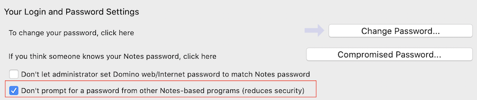

{::options parse_block_html="true" /}

## Windows installation

KEEP is supported for installation on Windows with an HCL Notes client **or** an HCL Domino server, but not both. (Should you install both, you are on your own.)
{: .alert .alert-info}

Installation on an HCL Notes client is for serverless product evaluation. **It is not supported for production use!**
{: .alert .alert-danger}

### Server installation

---

**Note** KEEP must be [installed](../index).

---

Run the installer to deploy KEEP for Domino (make sure to follow the .jar file name saved in your directory, followed by the parameters):

```bash
java -jar keepinstaller.jar ^
 -d="C:\Program Files\HCL\Domino\Data" ^
 -i="C:\Program Files\HCL\Domino\notes.ini" ^
 -p="C:\Program Files\HCL\Domino" ^
 -a
```

### All parameters

| Short | full parameter              | mandatory | Description                                                                     |
| :---: | --------------------------- | :-------: | ------------------------------------------------------------------------------- |
| `-d`  | `--dataDir=<dataDir>`       |     ✓     | Directory of your HCL Notes or Domino data                                      |
| `-i`  | `--ini=<notesIni>`          |     ✓     | HCL Notes/Domino notes.ini file                                                 |
| `-k`  | `--keepDir=<keepDir>`       |           | Directory for the Keep binary installation                                      |
| `-p`  | `--programDir=<programDir>` |     ✓     | Directory where HCL Notes or Domino is installed                                |
|       |                             |           |
| `-a`  | `--accept`                  |           | automatically accept terms & ccoditions                                         |
| `-h`  | `--help`                    |           | Show this help message and exit.                                                |
| `-n`  | `--noIniUpdates`            |           | Install the files, show updated ini entries, but don't write them out           |
| `-r`  | `--dryRun`                  |           | do not actually copy or alter files and settings                                |
| `-s`  | `--skipDirectoryCheck`      |           | skips the checks if the program and data directories<br /> contain Notes/Domino |
| `-V`  | `--version`                 |           | Print version information and exit.                                             |

The installer adds the `keep` task to the automatically starting tasks. If opted out using `-n` you can issue `load keep` manually in the Domino console.

Please refer to the [KEEP task](../../usingkeep/keeptask) page.

### Verifying the installation

The installer conducts a series of actions:

- Create the Keep directory in your local machine
- copy the `projectkeep[version-id].jar` file there
- create a libs folder in the Keep directory
- copy all supporting jar files there
- copy `keep` into the Domino directory
- update the `ServerTasks` variable in `notes.ini`, add `keep`
- add a variable `KeepCmdLine` to the `notes.ini` pointing to `startKEEP.cmd`

#### Server commands

Start using: `load keep`.

When you issue the console command `sh ta`, you will then see a task for "keep".

The administrator needs to add the `keep` task to the automatically starting tasks or issue `load keep` manually in the Domino console.

Please refer to the [The KEEP Task](../../usingkeep/keeptask) detail page.

Use `tell keep quit` to shut down KEEP. To restart KEEP, use `tell keep restart`.
{: .alert .alert-warning}

### Client installation

Run the installer:

```bash
java -jar keepinstaller.jar ^
 -d="C:\Notes\data" ^
 -i="C:\Notes\data\notes.ini" ^
 -k="C:\Program Files\HCL\Notes\KEEP" ^
 -p="C:\Program Files\HCL\Notes" ^
 -a
```

The command file `runKEEP.cmd` is designed for use with the Windows Notes Client. The parameters are the same as above for the server.

#### Verifying the client installation

The installer conducts a series of actions:

- Create the Keep directory
- copy the `projectkeep[version-id].jar` file there
- create a libs folder in the Keep directory
- copy all supporting jar files there
- create `runKEEP.cmd` in the Keep directory

<div class="panel panel-danger">
**Limitations to client use**
{: .panel-heading}
<div class="panel-body">

- Use is for evaluation only, don't use for production
- R12 requires Notes client to run and have "Don't prompt for a password from other Notes-based programs" set.
- You can't use a Notes client while you are running KEEP against your local Notes install.
- You can't run KEEP while the Notes client is running. You only need Notes client running to boot KEEP.



</div></div>
