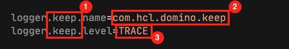

## Understanding Logging

Project KEEP uses the Apache [Log4J2](https://logging.apache.org/log4j/2.x/) logging framework. We configured it with reasonable defaults in the `log4j2.properties` file. It uses output to console and a logging file. The content looks like this:

```properties
# Root logger option
name=KeepLoggingConfig
status=error
appenders=stdout,rolling_file

rootLogger.level=INFO
rootLogger.appenderRefs=stdout,rolling_file
rootLogger.appenderRef.stdout.ref=STDOUT
rootLogger.appenderRef.rolling_file.ref=DailyRollingAppender

# KEEP specific logging
logger.keep.name = com.hcl.domino
logger.keep.level=DEBUG

# Console appender
appender.stdout.type=Console
appender.stdout.name=STDOUT
appender.stdout.layout.type=PatternLayout
appender.stdout.layout.pattern=%d{ISO8601} [%t] %-5p (%F\:%L) - %m%n

# File appender
appender.rolling_file.type=RollingFile
appender.rolling_file.name=DailyRollingAppender
appender.rolling_file.layout.pattern=%d{ISO8601} [%t] %-5p (%F\:%L) - %m%n
appender.rolling_file.fileName=./IBM_TECHNICAL_SUPPORT/domino-keep.log
appender.rolling_file.filePattern=./IBM_TECHNICAL_SUPPORT/domino-keep-%d{yyyy-MM-dd}.log 
appender.rolling_file.layout.type=PatternLayout
appender.rolling_file.policies.type=Policies
appender.rolling_file.policies.time.type=TimeBasedTriggeringPolicy
appender.rolling_file.policies.time.interval=1
appender.rolling.policies.time.interval = 1
appender.rolling.policies.time.modulate = true
appender.rolling.policies.size.type = SizeBasedTriggeringPolicy
appender.rolling.policies.size.size=10MB
appender.rolling.strategy.type = DefaultRolloverStrategy
appender.rolling.strategy.max = 30

```

In the production version the KEEP value will change from `logger.keep.level=DEBUG` to `logger.keep.level=INFO`

## Changing logging settings

You could edit the `log4j2.properties` file directly. However, depending on your installation it might sit inside a jar file and break the signature and get overwritten on any KEEP update.

The right approach is to amend the commandline parameters used to launch KEEP:

```bash
-Dlog4j.configurationFile=/path/to/modified/custom.properties
```

You can pick any of the [supported configuration](https://logging.apache.org/log4j/2.x/manual/configuration.html) formats: [XML](https://logging.apache.org/log4j/2.x/manual/configuration.html#XML), [JSON](https://logging.apache.org/log4j/2.x/manual/configuration.html#JSON) or [YAML](https://logging.apache.org/log4j/2.x/manual/configuration.html#YAML) (be aware YAML has additional runtime dependencies).

## Increasing log levels

To alter log levels (in the properties format) you need to specify a name and a log level:

```properties
logger.keep.name=com.hcl.domino.keep
logger.keep.level=TRACE
```



1. Key that defines the settings, used for levels and loggers
2. Java package the settings apply to
3. Log level for the given key

other settings can be added using the key to associate, e.g limit a specific logger setting to console output only

```properties
logger.keep.appenderRefs=stdout
logger.keep.appenderRef.stdout.ref=STDOUT
```

### Interesting packages

Depending on your interest, you can specify alternate log levels for Java packages. Potential package of interest (there are more) are listed below. Packages always include sub-packages unless they have their own specification.

| Package                       | Description                                                          |
| ----------------------------- | -------------------------------------------------------------------- |
| com.hcl.domino                | All of HCL's Domino interaction including DominoJNX and Project KEEP |
| com.hcl.domino.data           | DominoJNX data interactions                                          |
| com.hcl.domino.dql            | DominoJNX DQL access                                                 |
| com.hcl.domino.security       | DominoJNX ACL & ECL                                                  |
| com.hcl.domino.calendar       | DominoJNX Calendar API                                               |
| com.hcl.domino.keep           | All Project KEEP interactions                                        |
| com.hcl.domino.keep.verticles | Project KEEP vert.x verticles                                        |
| com.hcl.domino.keep.dbrequest | Project KEEP database interactions                                   |
| com.hcl.domino.keep.handlers  | Project KEEP http interactions                                       |
| com.hcl.domino.keep.security  | Project KEEP ACL & ECL                                               |
| io.vertx.core                 | vert.x foundation classes                                            |
| io.vertx.core.eventbus        | vert.x EventBus interactions                                         |
| io.vertx.core.http            | vert.x HTTP basic operations                                         |
| io.vertx.ext.web              | vert.x Web server functionality                                      |
| io.vertx.ext.web.openapi      | vert.x OpenAPI support                                               |

## Logger destinations

The KEEP logger configuration logs to the console (`STDOUT` - the expected behavior when running in a container like Docker, Kubernetes or Openshift) and to a rolling file appender retaining max 30 log files at 10M each.

Alternate logging destinations could be configured to suit specific enterprise needs, e.g. log to [Splunk](https://www.splunk.com/) ([Java logging](https://dev.splunk.com/enterprise/docs/devtools/java/logging-java/)), [NewRelic](https://newrelic.com/products/log-management), [LogStash](https://www.elastic.co/logstash/), [DataDog](https://www.datadoghq.com/dg/logs/log-management/) or [others](https://stackify.com/best-log-management-tools/).

Log4J2 has build in [support for JMX](https://logging.apache.org/log4j/2.x/manual/jmx.html#ClientGUI) or can log via UDP, so you can live watch using [Chainsaw](https://logging.apache.org/chainsaw/2.x/).

A UDP (e.g for chainsaw) configuration would look like this:

```properties
# UDP Appender
appender.udp_out.type=Socket
appender.udp_out.name=UDPOUT
appender.udp_out.protocol=UDP
appender.udp_out.layout.type=PatternLayout
appender.udp_out.layout.pattern=%d %-5p [%t] %C{2} (%F:%L) - %m%n
appender.udp_out.remotePort=8080
#127.0.0.1 works if your logging UI runs on the host of
#a KEEP container. Replace with actual destination IP if required
appender.udp_out.remoteAddress=127.0.0.1
```

Plenty more information is available on the [Apache Logging](https://logging.apache.org/log4j/2.x/index.html) website.
