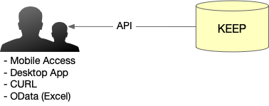
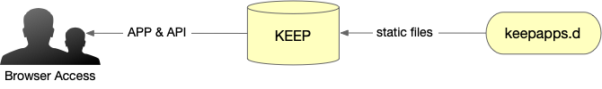
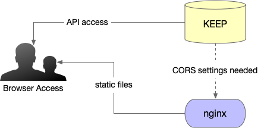
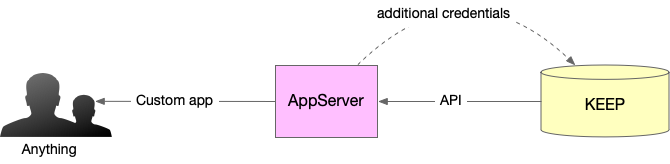
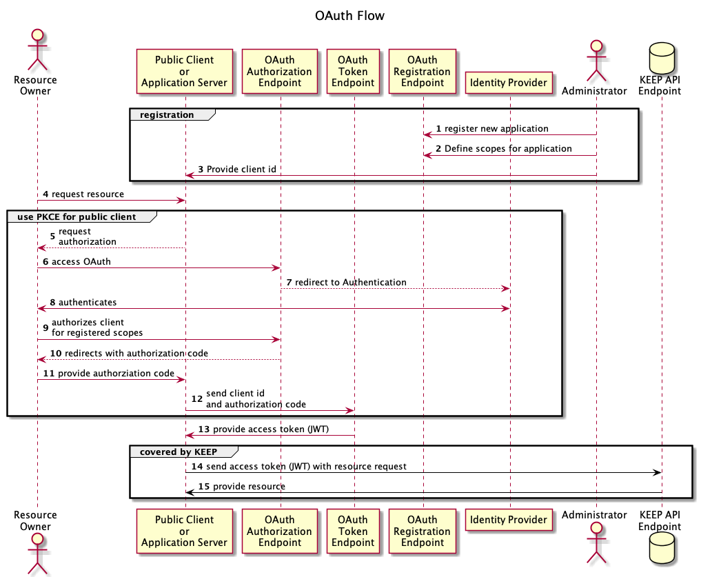
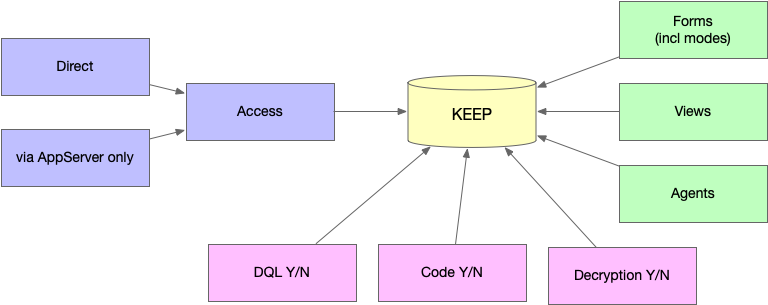

## Planning your application

KEEP allows a very flexible approach to utilize Domino as your NoSQL data store. This flexibility requires that you plan well and consider a number of questions, based on KEEP's properties.

### Application type

Determine what type of application you want to build.

If the planned application is mobile, desktop (including Excel), or just uses a command line with curl, it would use direct access.

If the planned application is a web application (build using ReactJS, Angular etc), you can host the static application files in `keepweb.d` directory or your Domino server of choice.

Finally, if the planned application is application-server-based, like NodeJS, Ruby, SpringBoot, PHP RUST or Go, it can sit between KEEP and the application. This type of application does not support open access and requires additional credentials.

### Authentication

KEEP provides an endpoint to exchange a Domino user name and password for a JWT Access Token. This is a great way to get started.

For more robust and flexible authentication, the use of an external identity provider (IdP) that generates the JWT access token as result of an OAuth flow is recommended.

### Detailed access management

The KEEP configuration allows you to fine tune access permissions. KEEP allows you to:

- Execute DQL queries. Further access can be fine tuned using an `@Formula.
- Post code snippets (JS or Groovy) for execution.
- Decrypt encrypted items, if the user has a suitable key.
- Specify which views to expose on the API.
- Specify which agents to expose on the API.
- Specify which forms to expose on the API.
  Here, [the Barbican's capabilities](../../howkeepworks/barbican) is used to tailor field access based on document data and current user, allowing for API-based data integrity.

