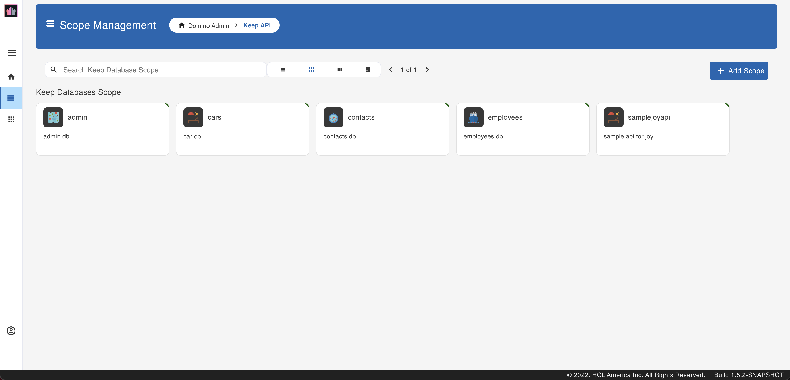
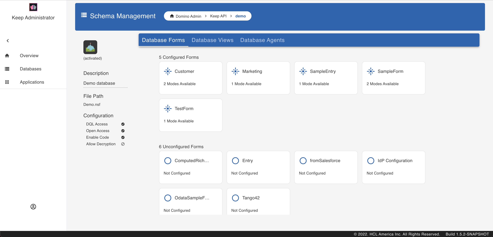
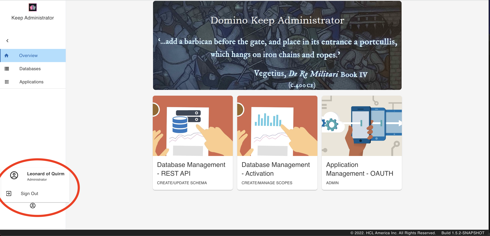

## Using Admin UI

This tutorial shows how to use the Admin UI to configure and use a database for KEEP. Download the database `Demo.nsf` from [Resources](../references/downloads) and follow along. Anything you can do with the Admin UI you can also do using Postman, curl, SwaggerUI or similar tools. See how to do each of the tasks in this tutorial using [Postman and curl]({{'tutorial/postmancurl' | relative_url }}) and using [SwaggerUI](./swagger).

### Prepare database access

Download `Demo.nsf` from [Resources](../references/downloads) and save it in the Notes data directory. 

### Login

Then login to the [KEEP Admin UI](http://localhost:8880/admin/ui/) using the administrator user name and password.

This is what the Login page looks like:

### List available databases
The landing page shows the list of all available databases.

### Add a database

In the upper right corner of the landing page is the 'Create Database' button.
{: .scale-img-eighty-five-percent }

Fill in the form and hit Create.

This creates the alias. You can use this to access the database via the KEEP API. One NSF can be made available under more than one alias (e.g. with different security settings).

### Specify the views

Select your database from the list of databases to load the database details. Select 'Database Views' from the blue menu bar. This lists all the views for the selected database.

Click the view to activate. This moves it the 'Activated Views' section. Hit 'Save' to save the selections. If you don't select a view, all the Views will be active.

Clicking on a view from the 'Activated Views' section undoes the selection.

### Specify the agents

Select your database from the list of databases to load the database details. Select 'Database Agents' from the blue menu bar. This lists all the Agents for the selected database.

Click the agent to activate. The agent moves to the 'Activated Agents' section. Hit 'Save' to save the selections. If you don't select an agent, all the agents will be active.

Clicking an agent from the 'Activated Agents' section undoes the selection.

### Specify the forms

Select your database from the list of databases to load the database details. Select 'Database Forms' from the blue menu bar. This lists all the forms for the selected database.

From the list of Unconfigured Forms, click the form to configure. Select 'Yes' on the popup to configure the form with default settings. The selected form is now listed under the Configured Form.

To make changes to the configuration, select the form to load the Access Mode for the form.

Set the Read or Write access formulas for each of the fields in the form.

### Logout
To log out, tap on the profile icon on the bottom left and click 'Logout'.

Refer to the [SwaggerUI tutorial](./swagger.md) for UI driven tutorial for creating a document and more.
