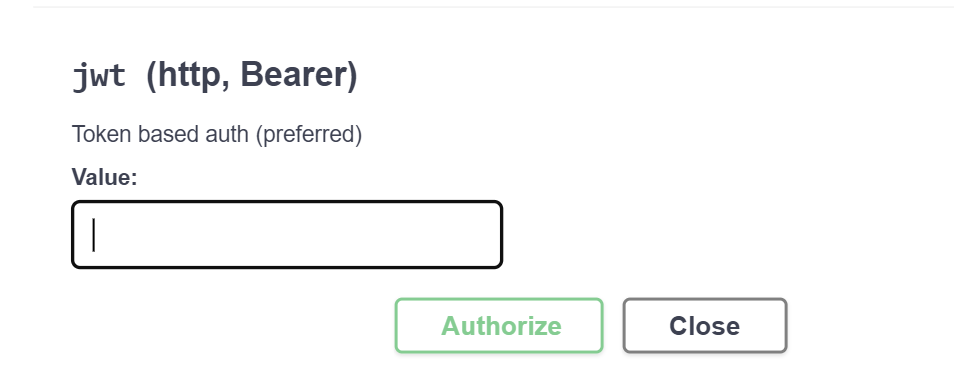
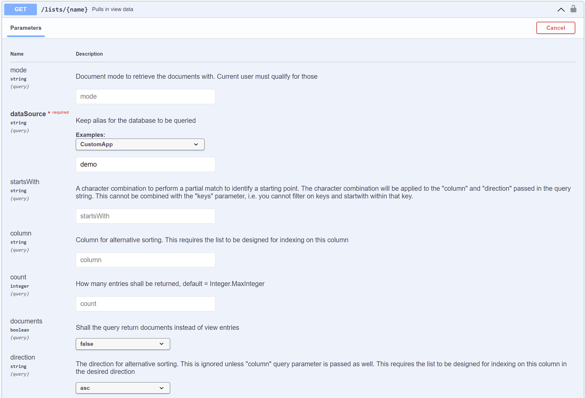

## SwaggerUI

This tutorial shows how to use SwaggerUI to create a document and to list views.

### Create a document with SwaggerUI

1. Go to [SwaggerUI](http://localhost:8880/openapi/index.html?url=/api/v1/schema/openapi.core.json).

2. Provide the JWT token for authorization:

3. Go to the required API and provide all the mandatory field values. Execute:

### List views with SwaggerUI

1. Follow Steps 1 and 2 from above.

2. Go to the required API and provide the db value. Execute.

### View the SwaggerUI for a specific KEEP Database

1. In the Explore field in the banner, enter "/api/v1/openapi?db=demo". This will display the KEEP OpenAPI specification specifically for the demo database.

2. Review the endpoints. The admin and design APIs are not included, because they are not appropriate for accessing the demo database's data. The `db` parameter is always "demo" because the OpenAPI specification is for that Keep database.

3. Review the Schemas at the bottom. If you have not specified read / write fields on a form, you will see the genericFormResult / genericFormRequest. If you have specified read or write fields, you will see a schema for "_formName_-_modeName_ Responses" / "_formName_-_modeName_ Requests".

If you URL encode "/api/v1/openapi?db=demo" you can create a URL to share with developers who consume the KEEP API for that database. The URL encoded value should be appended as the "url" querystring parameter. The resulting URL will look like "http://localhost:8880/openapi/index.html?url=/api/v1/openapi%3Fdb%3Ddemo", where the KEEP database name is after the "%3D" (url encoded "=").
