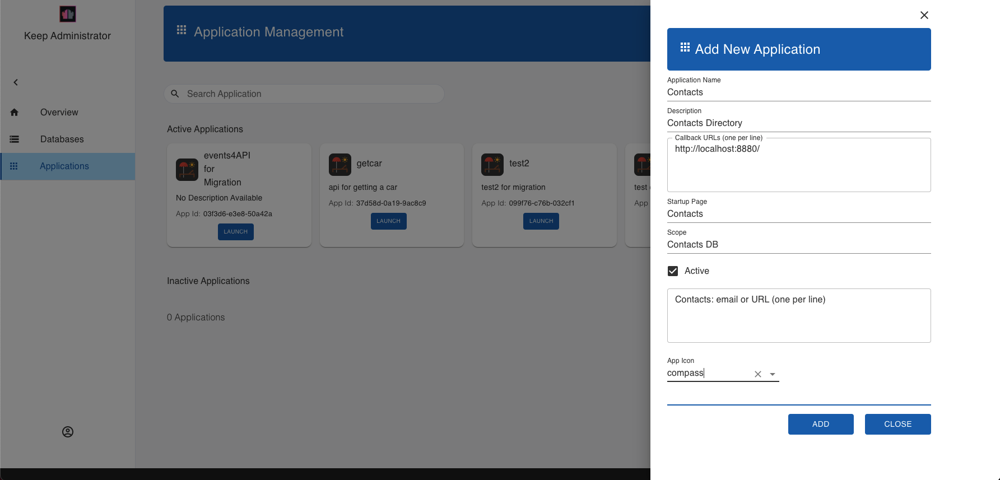
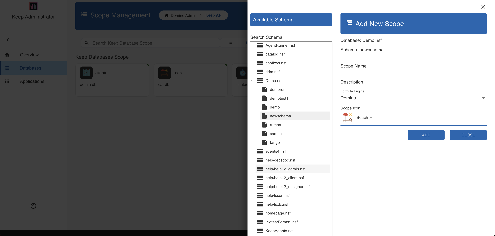
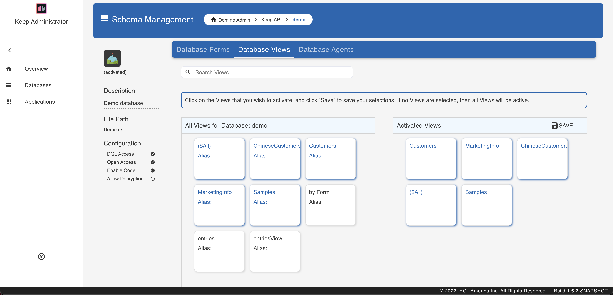

## Web UI for schema, scope and app management

The Admin UI provides a user interface to a number of KEEP APIs. It thus serves an example what a [React](https://reactjs.org/) application using the KEEP APIs is capable of. It covers chema, scope and app management management. Anything that can be done using the WebUI, and more, can also be done using Postman, curl, SwaggerUI or similar tools. We have tutorials to walk you through the same.

This is what the Login page looks like.

(Image: Castle [Johannisburg](https://en.wikipedia.org/wiki/Schloss_Johannisburg), Aschaffeburg, Germany)

You'll need the administrator username and password to access the server.

To use a Domino database in KEEP, it must be configured for use in the API. Download `Demo.nsf` from [Resources](../references/downloads) and save it in the Notes data directory. Then login to the [KEEP Admin UI](http://localhost:8880/admin/ui/) using the administrator user name and password.

### Application Management

Select [KEEP Application Management](http://localhost:8880/admin/ui/apps).

---

#### List Available Applications

The landing page shows the list of all available applications.

This applications can be dragged and dropped to change their state - Requested/Active/Approved/Inactive.

---

#### Add An Application

In the upper right corner of the landing page is the 'Add Application' button to add an application.
{: .scale-img-eighty-five-percent }

Fill in the form and hit Add.

Hovering over the application tile, gives the options to generate Application Secret, edit and delete the application.

---

### Database Management Tutorial

Select [KEEP Database Management](http://localhost:8880/admin/ui/databases) from the home page.

---

#### List Available Databases

The landing page shows the list of all available databases.

The database names can be arranged in either list or grid view or can be sorted alphabetically. There is also a provision to search through the list.

---

#### Add A Database

In the upper right corner of the landing page is the 'Create Database' button to add a database.
{: .scale-img-eighty-five-percent }

Fill in the form and hit Create.

This creates the Alias. You can use this to access the database via the KEEP API. One NSF can be made available under more than one alias (e.g. with different security settings).

---

#### List Available Views

Select a database from the list of databases and the details for it will load. Select 'Database Views' from the blue menu bar. This lists all the Views for the selected database.

Click on the View that you would like to activate. This will move it to the 'Activated Views' section. Hit 'Save' to save the selections. If no View is selected, then all the Views will be active.

Clicking on a View from the 'Activated Views' section, undos the selection.

---

#### List Available Agents

Select a database from the list of databases and the details for it will load. Select 'Database Agents' from the blue menu bar. This lists all the Agents for the selected database.

Click on the Agent that you would like to activate. This will move it to the 'Activated Agents' section. Hit 'Save' to save the selections. If no Agent is selected, then all the Agents will be active.

Clicking on an Agent from the 'Activated Agents' section, undos the selection.

---

#### List Available Forms

Select a database from the list of databases and the details for it will load. Select 'Database Forms' from the blue menu bar. This lists all the Forms for the selected database.

From the list of Unconfigured Forms, click on the Form that you would like to configure. Select 'Yes' on the popup. This will configure the form with default settings. The selected Form will now be listed under the Configured Form.

To make changes to the configuration, select the Form. This will load the Acccess Mode for the Form.

It is here that you can set the Read or Write access formulae for each of the fields in the form.

## <!--

### People Management Tutorial

Select [KEEP People Management](http://localhost:8880/admin/ui/people) from the home page.

---

#### List Available People

The landing page shows the list of all the users.

Sort order can be selected for each of the columns using the menu options.

---

#### Add A Person

In the upper right corner of the landing page is the 'Add Person' button to add a new user.
{: .scale-img-eighty-five-percent }

Fill in the form and hit Add.

Under the Actions column are the options to edit or delete the user.

---

### Group Management Tutorial

Once logged in to the [KEEP Admin UI](http://localhost:8880/admin/ui), select [KEEP Groups Management](http://localhost:8880/admin/ui/groups) from the menu on the left.

---

#### List Available Groups

The landing page shows the list of all the groups.

Sort order can be selected for each of the columns using the menu options.

---

#### Add A Group

In the upper right corner of the landing page is the 'Add Group' button to add a new group.
{: .scale-img-eighty-five-percent }

Fill in the form and hit Add.

Under the Actions column are the options to edit or delete the group. -->
