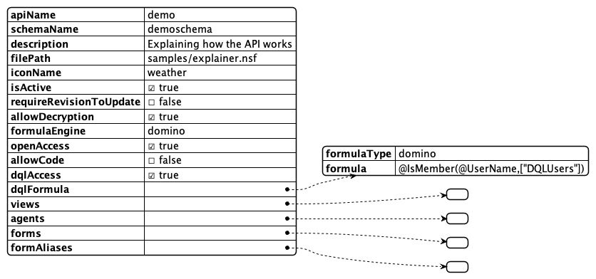

## Enabling a Database

By default KEEP does not expose databases on HTTPs. Enabling a database for REST access is a two (to three) step process:


1. **Create a KEEP Schema** in the NSF database to be enabled. A database can have one or more KEEP schemas for different access needs. A KEEP schema is stored as JSON file in the database's design file resources. A brave developer could use Domino designer to create or update one. The rest (pun intended) use the API or the "Schema and Scope Management UI" (colloquially known as AdminUI).

2. **Link a schema to a scope** THis link is stored in the directory next to the internet sites and is the responsibility of the administrators. The scope is party of the url that will get used from the outside and hence hard to change later. Therefore a schema can be linked to more than one scope.

3. Optional **Create an OAuth application** When you use KEEP as your IdP, you can create one or more OAuth applications that can access one or more of the defined scopes.

## The KEEP Schema

defines what views, folders, document and agents can be accessed through the KEEP API. Access to documents is controlled by accessing their `Form` item and use the value to lookup access definitions, called `Mode` in KEEP's lingo that define the item names and properties accessible read- or writeable.

Since the exact terminology is long winded and colloquially often no distinction is made between document/item and form/field, the short version is: The KEEP schema controls accesss to forms and fields.


While the AdminUI helps to generate a KEEP schema from an exisitng form, there no technical need for a form to be present, other than the possibility to open the Notes document in a Notes client too. Creating such a Schema requires direct post to the API.

## Schema components

**Note** | Please refer to the OpenAPI sspecification running on your server. It is the definite guide for your deployed version.
{: .alert .alert-danger}

The high level entry contains a few properties and the collection of forms, views and agents made avaiable:



| Entry                       | Description                                                                              |
| --------------------------- | ---------------------------------------------------------------------------------------- |
| **apiName**                 | public name mapped to the schema, a.k.a `scope` or `?dataSource=`                        |
| **schemaName**              | internal name, matches the JSON file name in Domino design                               |
| **description**             | visible in AdminUI                                                                       |
| **filePath**                | path to nsf relative to data directory                                                   |
| **iconName**                | name of the icon (fixed set) used in the UI. Alternative `icon` can contain a Base64 svg |
| **isActive**                | Can the API be used now                                                                  |
| **requireRevisionToUpdate** | Measure to prevent overwrite conflicts                                                   |
| **allowDecryption**         | WHen also the user hass the permission, decrypt documents                                |
| **formulaEngine**           | domino (current only option)                                                             |
| **openAccess**              | true - allow acces when user has $DATA scope, false: require exact scope                 |
| **allowCode**               | Run supplied external code                                                               |
| **dqlAccess**               | allow DQL queries                                                                        |
| **dqlFormula**              | Domino formula with @True/@False result to restrict use of DQL query access              |
| **views**                   | collection of available views                                                            |
| **agents**                  | collection of available agentd                                                           |
| **forms**                   | collection of available forms                                                            |
| **formAliases**             | defined aliases to avoid duplicate definitions                                           |

### Views

An array of entries describing name, alias(es), if any and UNID of the view design element.
Views will show all columns contained


### Agents

An array of agent names that can be called from the REST endpoint. The API doesn't check if the agent is suitable for being called individually, it is the developers responsibility to ensure this.

### Forms & Mode

The form array has Form entries with 2 elements:

- **formName**: Ideally the value stored in "`Form`" items. Alias resolution provided by `formAliases` element
- **formModes**: Named schema for a form defining fields and access conditions. A form needs at least one FormMode to make documents available on KEEP. There are three mode names with special meaning:
  - **default** : The first (and last) formMode in a KEEP schema
  - **odata** : The mode used when accessing KEEP's ODATA endpoints
  - **dql** : The mode used when executing a DQL query


| Entry               | Description                                                                                                    |
| ------------------- | -------------------------------------------------------------------------------------------------------------- |
| modeName            | lowercase letters, used in URL addressing                                                                      |
| fields              | Array of KeepFields defining field properties (see below)                                                      |
| readAccessFormula   | Domino formuls that needs to compute to @True/@False to determine if this mode is available for read access    |
| writeAccessFormula  | Domino formuls that needs to compute to @True/@False to determine if this mode is available for write access   |
| deleteAccessFormula | Domino formuls that needs to compute to @True/@False to determine if this mode is available for delete access  |
| required            | Array of field names that must be provided on creation or update. Following the JSON schema specification here |

#### Accesss formulas

The avalability of access formulas follows typical Notes development pattern where actions are rendered based on Formula conditions (a.k.a HideWhen formula). Typically those formula include references the user name, role or group membership and item values like `Status` or `Approver`

#### KEEP Fields

We follow the ideas proposed by [JSON schema](https://json-schema.org) with the intention to support most of the constrains available there at some point in time.


| Entry       | Description                                                        |
| ----------- | ------------------------------------------------------------------ |
| name        | Field name mapping to item name                                    |
| type        | Type as permitted by [JSON](https://www.json.org/json-en.html)     |
| items       | when type = `array`, entry with type/format for array entries      |
| format      | data format as specified in [JSON schema](https://json-schema.org) |
|             | with the addition of Notes specific `names`, `authors`, `readers`  |
| readyOnly\* | Field value can be read, but not written                           |
| writeOnly\* | Field value can be written, but not read                           |
|             | \* only one can be set true at a time                              |
| fieldGroup  | allows to group a set of multi values into records                 |

#### FieldGroups

A typical Notes constuct are documents containing a group of multi value fields, where values with the same index position form a record. On the REST API that is an odd construction. A document might get returned like this:


By assigning the fields `Name`, `age` and `fruit` the **fieldGroup** `LostBoys`, KEEP will render them as records in an JSON Object. We opted for an object to ease processing and addressing since arrays might not have a guarantee of sequence. The result lookd like this:


### Form aliases

## Deployment Steps

Follow the tutorial for instructions on how to do it using [AdminUI](../tutorial/adminui) or [Postman or curl](../tutorial/postmancurl).

It is worth noting that all the actions that you can do using the Admin UI can also be done using Postman, curl or any similar tool.
Below are some examples to perform additional actions for database, people and application management, like adding a database, listing views, agents and forms, listing and adding application and listing and adding person.

A group of API requests is known as a collection. Each collection may have subfolders and multiple requests. Request URL or the endpoint is used to identify the link to where the API will communicate with.

**Note** | when using the code snippets provided, replace `$Bearer` with actual Bearer value.
{: .alert .alert-success}

### Add a database

To add a database, run the following command. Find the applicable Request URL from the OpenAPI Specification document. Provide the body for Post request.


#### Curl code snippet 1

```bash
curl --location --request POST 'localhost:8880/api/v1/admin/database' \
--header 'Authorization: Bearer $Bearer' \
--header 'Content-Type: application/json' \
--data-raw '{
    "apiName": "demo",
    "description": "Demo database",
    "filePath": "Demo.nsf",
    "icon": "Base64 stuff, preferably SVG",
    "iconName": "Demo",
    "formulaEngine": "domino",
    "owners": [],
    "isActive": "isActive",
    "excludedViews": [],
    "agents": [],
    "storedProcedures": [],
    "dqlAccess": true,
    "dqlFormula": "@IsMember(@UserNamesList;\"LocalKeepAdmins\")",
    "allowCode": true,
    "openAccess": true,
    "applicationAccessApprovers": [
        "LocalKeepAdmins"
    ]
}'
```

### List available views

To list the views, run the following command. Find the applicable Request URL from the OpenAPI Specification document.Execute. For Get request,body is not needed.


#### Curl code snippet 2

```bash
curl --location --request GET 'localhost:8880/api/v1/lists?db=demo' \
--header 'Authorization: Bearer $Bearer' \
--header 'Accept: application/json'
```

### Retrieving views

Find the applicable Request URL from the OpenAPI Specification document. Execute. For Get request, body is not needed.


#### Curl code snippet 3

Please replace `$Bearer` with actual Bearer value.

Please replace `{{name}}` with actual name.

```bash
curl --location -g --request GET 'localhost:8880/api/v1/lists/{{name}}/default?db=demo' \
--header 'Authorization: Bearer $Bearer' \
--header 'Content-Type: application/json' \
--data-raw ''
```

### List available agents

To list the agents, run the following command. Find the applicable Request URL from the OpenAPI Specification document.Execute. For Get request, body is not needed.


#### Curl code snippet 4

```bash
curl --location --request GET 'localhost:8880/api/v1/design/agents?db=demo' \
--header 'Authorization: Bearer $Bearer '
```

### List available forms

To list the forms, run the following command. Find the applicable Request URL from the OpenAPI Specification document.Execute. For Get request, body is not needed.


#### Curl code snippet 5

```bash
curl --location --request GET 'localhost:8880/api/v1/design/forms?db=demo' \
--header 'Authorization: Bearer $Bearer '
```

### Creating a document


Find the applicable Request URL from the OpenAPI Specification document. In Postman, include the request body in JSON format for the POST request.

In the upper right corner there is a send button. Execute it.


The curl command for the above can be found using the symbol.


#### Curl code snippet 6

Please replace `$Bearer` with actual Bearer value.

```bash
curl --location --request POST 'localhost:8880/api/v1/document?db=demo' \
--header 'Authorization: Bearer $Bearer' \
--header 'Content-Type: application/json' \
--data-raw '{
    "first_name": "George",
    "last_name": "Branthwaite",
    "email": "gbranthwaite0@nba.com",
    "gender": "Male",
    "ip_address": "91.254.204.27",
    "Color": "Red",
    "Pet": "Black-capped chickadee",
    "Form": "Customer"
}'
```

### Retrieving a document

Find the applicable Request URL from the OpenAPI Specification document.Execute.For Get request ,body is not needed.


#### Curl code snippet 7

Please replace `$Bearer` with actual Bearer value.

Please replace `{{UNID_0}}` with actual UNID.

```bash
curl --location -g --request GET 'localhost:8880/api/v1/document/{{UNID_0}}/default?db=demo' \
--header 'Authorization: Bearer $Bearer' \
--header 'Content-Type: application/json' \
--data-raw ''
```

### List available applications

To live the available applications, run the following command. Find the applicable Request URL from the OpenAPI Specification document.Execute. For Get request, body is not needed.


#### Curl code snippet 8

```bash
curl --location --request GET 'localhost:8880/api/v1/admin/applications/all' \
--header 'Authorization: Bearer $Bearer ' \
--header 'Content-Type: application/json' \
--data-raw '{
   "appName": "My Second Application",
   "databasesRequested": [
     "keepconfig",
     "demo"
    ]
}'
```

#### Add an application

To add an application, run the following command. Find the applicable Request URL from the OpenAPI Specification document. Provide the body for Post request.


##### Curl code snippet 9

```bash
curl --location --request POST 'localhost:8880/api/v1/admin/application' \
--header 'Authorization: Bearer $Bearer ' \
--header 'Content-Type: application/json' \
--data-raw '{
   "appName": "My Demo Application",
   "databasesRequested": [
      "demo"
    ]
}'
```

### List available people

To list the available people, run the following command. Find the applicable Request URL from the OpenAPI Specification document.Execute. For Get request, body is not needed.


#### Curl code snippet 10

```bash
curl --location --request GET 'localhost:8880/api/pim-v1/public/people' \
--header 'Authorization: Bearer $Bearer' \
--data-raw ''
```

### Add a person

To add a person, run the following commands. Find the applicable Request URL from the OpenAPI Specification document. Provide the body for Post request.


#### Curl code snippet 11

```bash
curl --location --request POST 'localhost:8880/api/pim-v1/public/person' \
--header 'Authorization: Bearer $Bearer ' \
--header 'Content-Type: application/json' \
--data-raw '{
    "Form": "Person",
    "Type": "Person",
    "Title": "",
    "FirstName": "Demo",
    "MiddleInitial": "",
    "LastName": "",
    "Suffix": "",
    "CompanyName": "",
    "email_1": "",
    "OfficeCity": "",
    "OfficePhoneNumber": "",
    "PhoneNumber": "",
    "CellPhoneNumber": "",
    "primaryPhoneNumber": "",
    "FullNameInput": "Demo ",
    "AltFullName": "",
    "AltFullNameLanguage": "",
    "InternetAddress": "",
    "FullName": "Demo ",
    "MailAddress": "",
    "ELabel2": "Personal",
    "ELabel3": "Assistant",
    "ELabel4": "Business2",
    "Elabel5": "Personal2"
}'
```

### List available groups

To list the available groups, run the following command. Find the applicable Request URL from the OpenAPI Specification document.Execute. For Get request, body is not needed.


#### Curl code snippet 12

```bash
curl --location --request GET 'localhost:8880/api/pim-v1/public/groups' \
--header 'Authorization: Bearer $Bearer' \
--data-raw ''
```

### Add a group

To add a group, run the following command. Find the applicable Request URL from the OpenAPI Specification document. Provide the body for Post request.


#### Curl code snippet 13

```bash
curl --location --request POST 'localhost:8880/api/pim-v1/public/group' \
--header 'Authorization: Bearer $Bearer' \
--header 'Content-Type: application/json' \
--data-raw '{
    "ExcludeFromView":[
      "D",
      "S",
      "A"
    ],
    "PROTECTFROMARCHIVE":1.0,
    "Form":"Group",
    "ListDescription":"Sample Test Group",
    "Confidential":"",
    "Comment":"",
    "ListOwner":"CN=Michael Angelo Silva/OU=Philippines/O=PNPHCL",
    "LocalAdmin":"CN=Michael Angelo Silva/OU=Philippines/O=PNPHCL",
    "AvailableForDirSync":"1",
    "DocumentAccess":"[GroupModifier]",
    "GroupType":"0",
    "ListName":"Test Group",
    "Readers":"",
    "Members":"",
    "Categories":"",
    "Type":"Group",
    "GroupTitle":"0",
    "SavedUpdate":"1"
  }'
```
