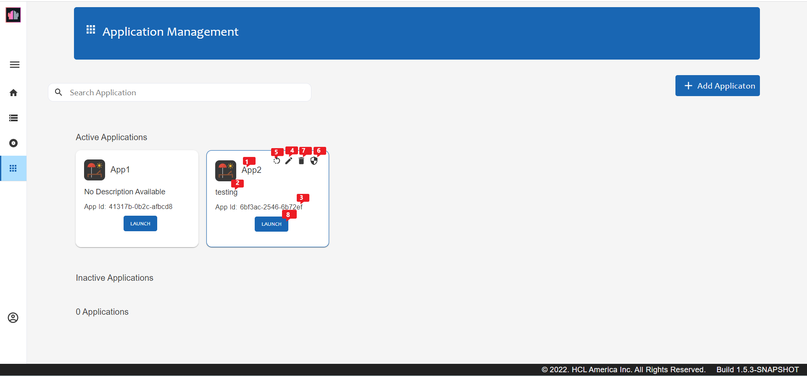

## Connecting your application to KEEP

Any programming language is able to connect to a REST API.
Depending on your approach, there are some particularities to observe.

We distinguish between client and server based applications.
**Client based applications** can access databases that have been marked for **Open Access**,
while **server based applications** can provide an application id and application secret to get a different level of access.

### Browser based applications

Browser based applications (ReactJS, Angular, Vue, VanillaJS) can be hosted on a different server than the URL of the KEEP API.
To enable access to KEEP (besides the user's credential), [CORS](https://developer.mozilla.org/en-US/docs/Web/HTTP/CORS) need to be configured to allow access from the server providing
the static files to KEEP. This is configured in the `security.json` in the `CORS` section. You need to add your domain and set it to `true`. To simplify corporate deployment, we check domain endings only. Which means that `acme.com` covers `www.acme.com`, `hr.acme.com` or even `one.two.three.acme.com`.

The default entry in `security.json` is like this:

```json
"CORS": {
        "localhost": true,
        "hcl.com": true,
        ".local": true
    }
```

Let's say you want to disable the preset and enable `acme.com`, you create a `security.json` with this content:

```json
{
  "CORS": {
    "localhost": false,
    "hcl.com": false,
    ".local": false,
    "acme.com": true
  }
}
```

### Hosting your static application on KEEP

Frameworks like Angular, ReactJS, Swelte etc. usually generate a `build` directory with a set of static files.

You can copy that directory to `keepweb.d` in your Domino data directory and KEEP will serve them on the `/keepweb/` URL path. This eliminates the need for CORS configuration

Check the details in [Security Configuration](../installconfig/configuration/security).

### Server based applications


In the Admin Client (or the [Admin API](administrationui.md)), we can define an "application" which consists of:



1. App Name, gives name of the application.
2. Description, description for application given while creating
3. AppID, which is the Application ID.
4. Edit, to edit the details application while creating it.
5. Generate Application Secret, It generates the application secret.
6. Client_Secret, which is the secret defined for the application. It is generated when Generate Application secret is clicked.
7. Delete, to delete the application.
8. Launch, to launch the application.

Along with above application also has Scopes, which is the list of KEEP database that the application wants to access. It is added whle creating the application. Can edit it through Edit option.


When the application presents AppID and ClientSecret in the header of a request, it can access the databases,
even when they are not defined as "Open Access". This information is required for an application to use an OAUTH flow to gain access to data. Thus, an application server can have more access than a browser application.

KEEP offers an OAUTH/OICD controlled access.

### Desktop applications

These are applications designed using Java or .NET, Electron or shell scripts with curl.

Since desktop applications can't keep secrets, we treat them like browser applications. They can only access Domino databases that are flagged for "Open Access". You don't need to worry about CORS setup, unless you are running a local http server. This is why localhost is in the default CORS permission list.
