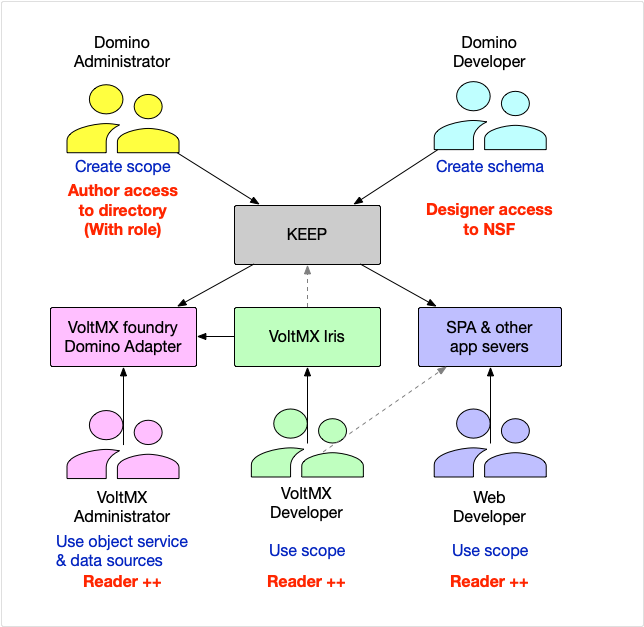

## KEEP roles

Depending on your organization's size and structure multiple roles can be held by one person or team, or the organisation might have specialized teams representing each role. Or it's a mix of both.

### Domino developer

creates the **schema** that defines what data can be accessed in a nsf database. Schemas can be created using the KEEP API, the KEEP GUI or Domino designer editing the schema JSON file.  
The Domino developer needs `Designer` access to the databases to create or update schemas. Schemas are subject to standard inheritance rules, so a schema in a template will be inherited by databases derived from it

### Domino/KEEP administrator

creates and activates the **scope** that defines how the data can be accessed. Also creates (optional) OAuth compatible applications with `client_id` and `client_secret` properties. These activities can be completed using the KEEP API or the KEEP GUI. The administrator needs `Editor` (or at least `Author` with the `[KeepAdmin]` role) to the Domino directory (For the beta it's `KeepConfig.nsf`)

### VoltMX administrator

configures Volt MX's foundry middleware to interact with KEEP using the foundry KEEP adapter. Needs to be able to read data from a KEEP scope, so minimum access is `Reader`. The Domino adapter marshals user permissions to KEEP. There is no "database user" that holds all connections, but individual user permission.

### VoltMX developer

develops applications leveraging KEEP Endpoints, VoltMX services with the VoltMX Iris IDE. Needs to be able to read data from a KEEP scope, so minimum access is `Reader`. When the application wants to update data in Notes, higher access will be required.

You are not limited to Domino and VoltMX specific roles. Classical development is possible too!
{: .alert .alert-info}

### Web developer

develops applications leveraging KEEP Endpoints, VoltMX services using front-end tools like VSCode, Bootstrap or any tools and framework of choice. Needs to be able to read data from a KEEP scope, so minimum access is `Reader`. When the application wants to update data in Notes, higher access will be required.

### Mobile developer

develops applications using the SDKs native to the mobile OS like XCode or Android studio. Needs to be able to read data from a KEEP scope, so minimum access is `Reader`. When the application wants to update data in Notes, higher access will be required.

The **VoltMX Iris IDE** allows to create multi-device experiences without getting lost in device specifics.
{: .alert .alert-danger}
